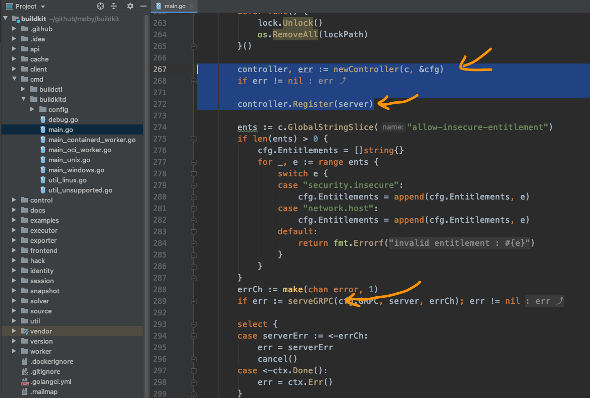
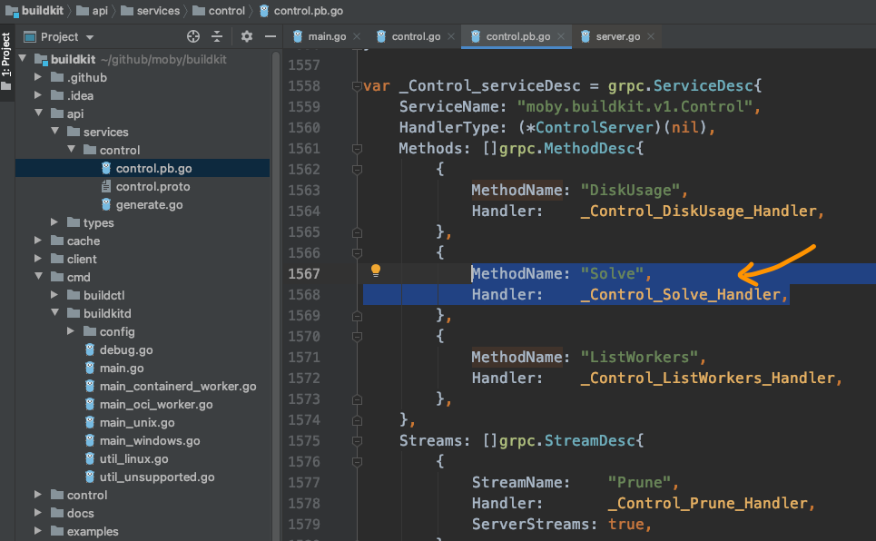
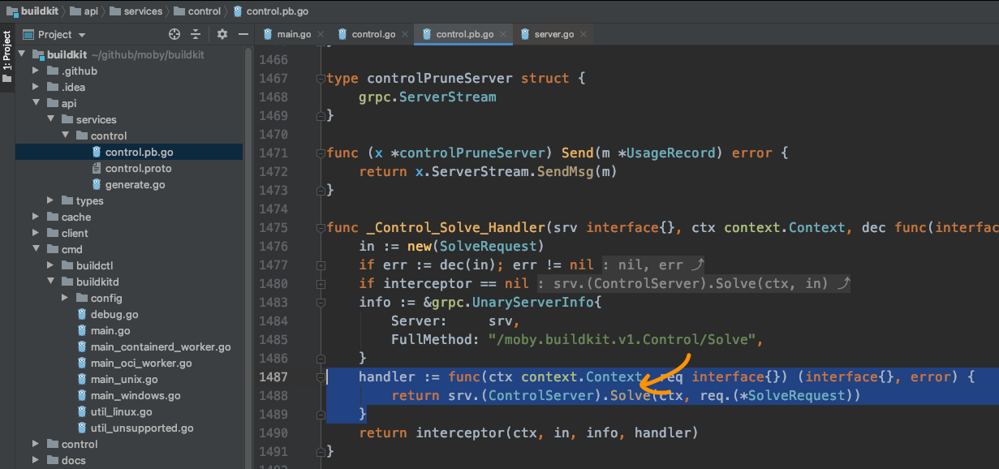
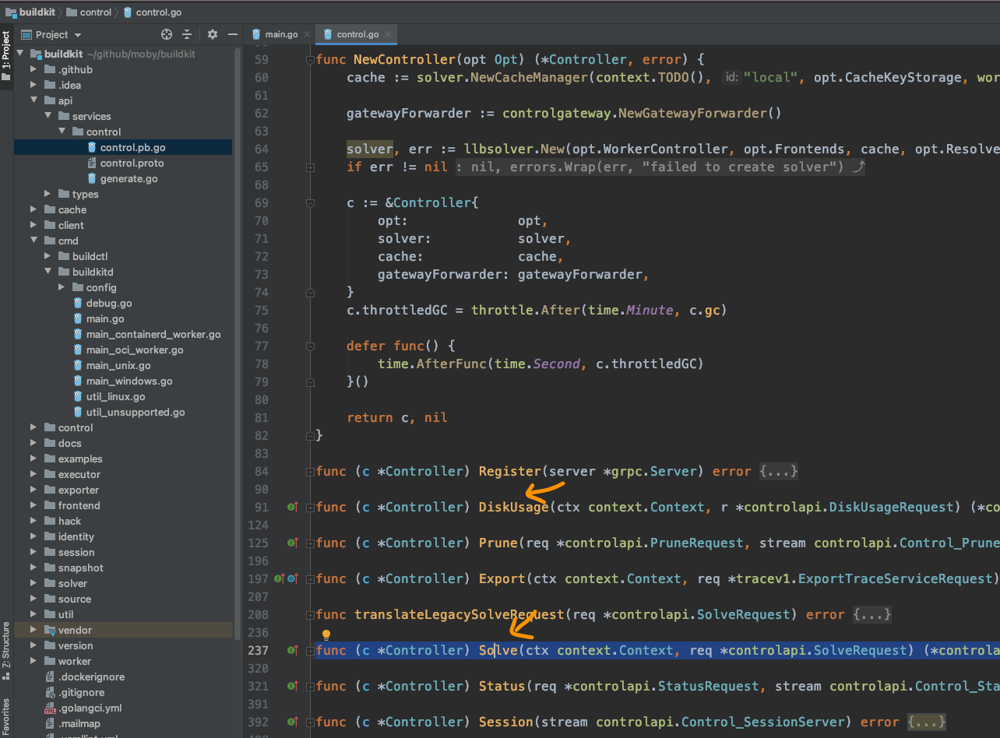

# frontends发射器

本来想着周一就找龙飞好好咨询一下，可好巧不巧，这两天龙飞都很忙。
因为有一个新的项目启动了，正在准备项目的iteration 0（迭代零）。
好容易等到周三，龙习终于有时间了，迫不急待的问道：

我顺着`buildctl build`命令，看到了`control.pb.go`文件里的c.cc.Invoke，后面编辑器就没法帮我定位到下面的函数了，不知道从哪儿查起了。

龙飞听完，想了想，很快说到，应该是前端的请求最后一步了，发出GRPC请求。
接下来就是`buildkitd`接收到请求，开始处理了。
说着打开源码，快速找到`buildkit/cmd/buildkitd/main.go`的`main`函数的GRPC服务相关的代码：

就像代码里提到的，先创建一个controller，然后将controller注册到服务，最后启动服务，当然这里是GRPC服务。这样就可以接收并处理前端的请求。
从前面得知，请求的链接是`moby.buildkit.v1.Control/Solve`，那我们可以猜测一下这个服务地址是需要提前注册的，对吧。
那我们看看controller.Register(...)这个操作。

随着一步步跳转，果然"Solve"这个方法出现在眼前：

并且显示的处理方法是`_Control_Solve_Handler`：

这里代码显示的是会找到server，并调用`Solve`方法。

然后我们再回过头来看看`newController`所创建的对象，因这这个对象被注册到了server里，那我们现在去确认一下，这个对象是否有`Solve`方法，如果要保险，可以再确认一下其它的方法，像`DiskUsage, ListWorkers`。

经过简单的查找，果然：

controller的方法里，确实包含了我们想要的对象，终于连接上了，看来可以从这里再继续探索了。

袁小白一边感谢着龙飞，一边不禁心生敬意。

真是山穷水尽疑无路，柳暗花明又一春。

看源码的体验就是这样，碰到问题，解决问题，再碰到问题，再解决问题，如此反复。
这也是大家不喜欢看别人源码的原因，很多时候，比起看别人的代码，更想自己从头写一份。

袁小白下一次又会卡在哪儿呢？
不用担心，很快就会看到的。
