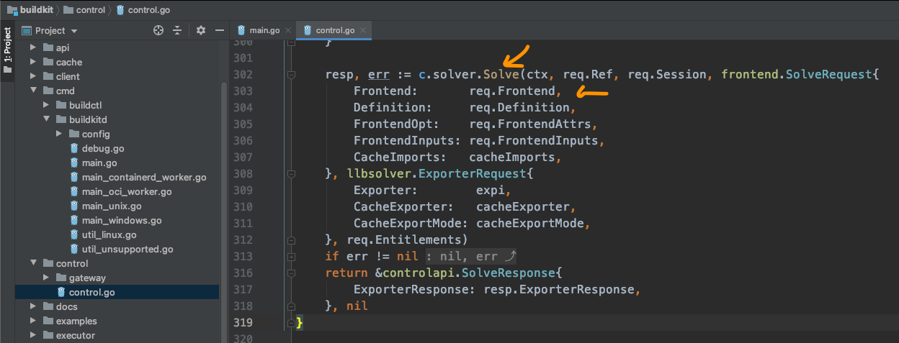
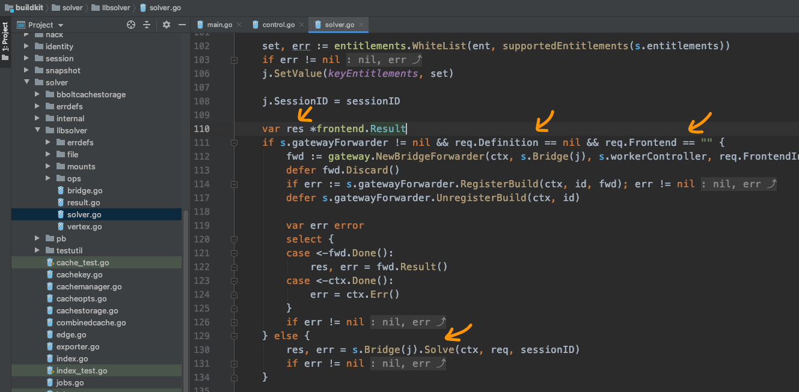
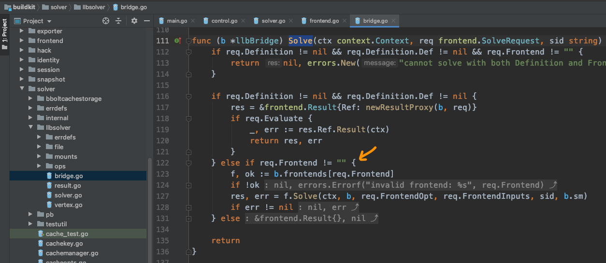
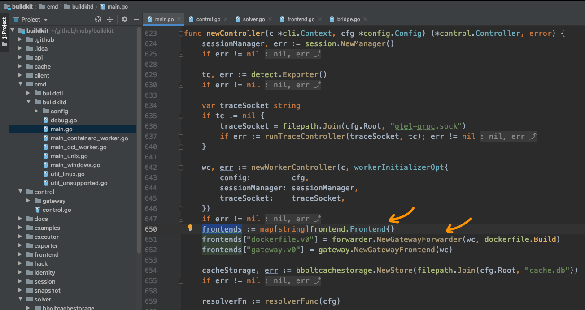
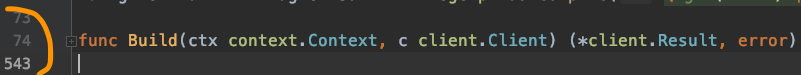
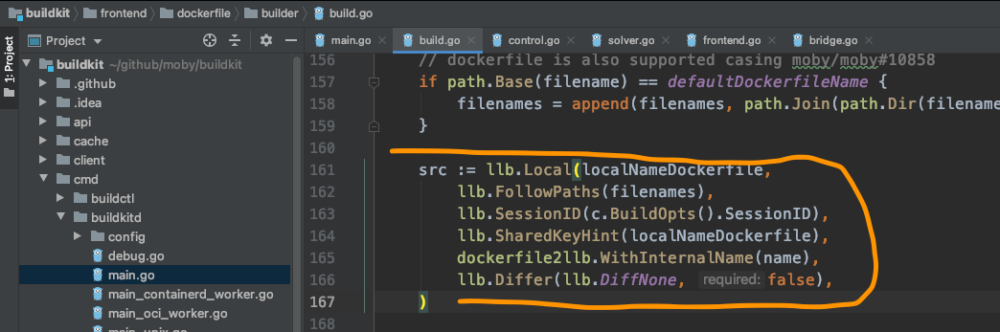
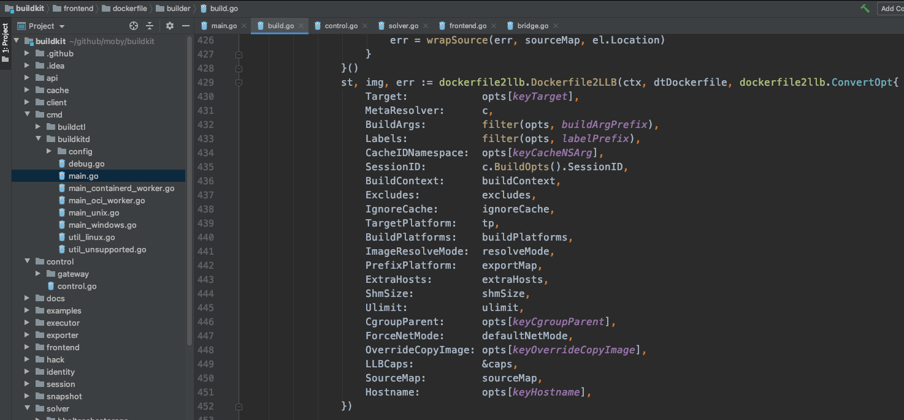
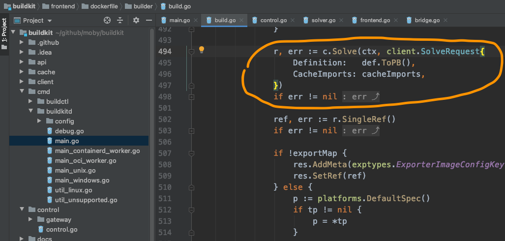

# 套娃越开越小，这坑是越挖越大

有了龙飞的指导后，总算是将断了的线索又重新给接了起来。
袁小白的理解是，前面就像是客户端，准备参数，向服务器发送请求，服务器接收到请求后，进行处理。
而且服务器提供的是GRPC类型的服务，应用的是HTTP协议。
基于这样的理解，袁小白搓着手，信心满满的打开了下一个`Solve`方法：

可以看到，在control里面，调用solver，并进行`Solver`。
这里的参数什得我们关注，如有传入Frontend相关信息，不过req.Frontend是字符型，也就是说这里传的只是Frontend的类别，比如咱们这里就是dockerfile。
下面的Definition也值得我们关注，还记得前面有提到，如果是`./example | buildctl build`，那么这里的Definition就是从标准输入读取的，目前我们用的是读取dockerfile的方法，也就是说这一项是为空的。

接下来再看`c.solver.Solve(...)`:

终于我们看到了frontend.Result，也就是说这里会用到Frontend，解析dockerfile后，产出结果。
在这里分了两种情况：
* 如果req.Definition == nil且req.Frontend == ""，很明显，我们不属于这种情况
* 剩下的都是由s.Bridge(j).Solve(...)来处理了

自然而然，袁小白，又打开了bridge，查找起了又一个Solve:

果不其然，这里我们终于找到了frontend使用的地方，通过b.frontends map用req.Frontend取得frontend实例，然后用f.Solve真正的开开始解析。

那这些实例又是在哪儿初始化的呢？
这时，袁小白想起来龙飞说的话 - 初始化都是在创建controller实例了时候进行的。
想到这，就打开了buildkitd，的主函数，并查找实例化controller的地方：

果然如龙飞所说，就是在newController的时候，也初始化好了frontends，并且这里就有dockerfile的类型，而且保存的是一个GatewayForwarder实例，但可以看出，真正处理的还是dockerfile.Build方法，终于找到了这里，袁小白不禁兴奋的咽了口口水。

可好景不长，这个Build函数的将近500行，扫了一眼代码，挫败感又卷土重来:

没办法，只好硬着头皮上了。

前面的一些常规配置读取到还无关紧要，但后面的一串操作让袁小白不知所措。
比如llb系列：

再比如这个长长的Dockerfile2LLB方法：

最奇怪的是，这里面又来了一次c.Resolve:

咱们不是刚从client.Solve过来的吗？

问题一个接一个，实在是泥牛入海，使不上劲的感觉。
