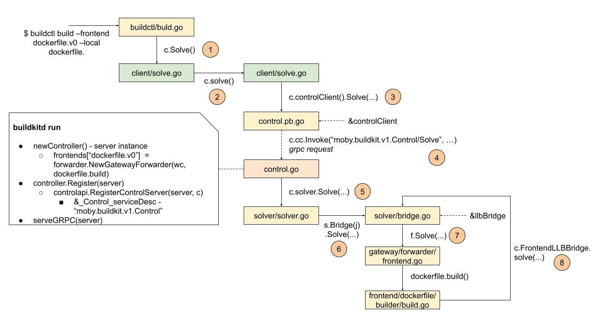
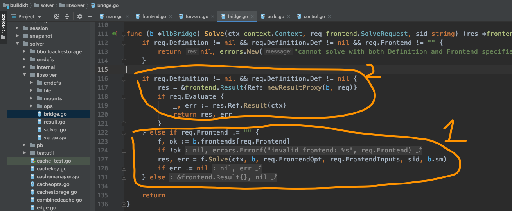

# 数据结构

龙飞似乎预感到了袁小白会再次发现新的疑惑点，因为龙飞自己通过上一次和袁小白一起梳理后，也感觉到有一些细节在第一次的梳理时，是有漏掉的，带着这些新的线节，龙飞将Frontends flow又重新整理了一遍：

袁小白一看见这张图，好像脑子里正在到处游走的信息，一下子都找到了自己的位置，独立确有了明显的规律。

看到袁小白的目光被Frontend flow给吸引住，龙飞开始说道。

这个解析流程确实有点绕，单单一个solve，就出现了8次，这就会让我们产生一些疑问：这些solve都是一个意思吗，在不同的对象里，如buildctl, client, control, solver等等，这些solve在这些对象里难道都是拥有同样的意义？
不过不要急，让我们按这个流程再走一遍，看看作者到底想表达什么？

* 用户调用命令行`buildctl build --frontend dockerfile.v0 --local dockerfile ...`，这里是整个流程的触发点，这里我们要开始解析用户的构建需求，而这些需求都按dockerfile的格式表达了出来
* 因为是C/S(client/server)结构，所以在客户端，我们需要有一个`client`，用来处理网络请求
* 可能还需要更确切的客户端，所以这里需要的一个controlClient，用来发送解析请求
* 终于，可以发出解析请求了，这里需要发送的是grpc请求 - moby.buildkit.v1.Control/Solve
* 前端发出请求后，剩下的也就要交给后端了，这里后端为了处理好解析请求，需要做好充足的准备。比如需要准备好frontends实例，因为需求上需要支持多种不同的frontend，而dockerfile只是前端的一种，况且这还是亲儿子，必需得支持好。其次为了GRPC的注册和管理能统一管理，这里control需要关心的就是提供对应的方法函数。而GRPC服务相关的就交给controller.Register了，像URL匹配，及GRPC服务相关的设置项都统一提前准备好。因为有了这些准备，control成功接收了前端发来的解析请求。
* 为了正确解析，solver需要将真正提供解析服务的frontend关联起来，所以需要一个bridge
* bridge并不能自己解析，需要找到真正的frontend实例，如这里的frontends["dockerfile.v0"]，也就是frontend中dockerfile提供的build方法，因为需要解析中间状态，所以有一个回调，这里要注意，虽然都是调用的llbbridge.solve，但两次所走的代码分支是不一样的：

分别是第一次req里传过来的是字符型frontend种类，第二次是经过解析后的拥有req.Definition，并用ResultProxy封装了已解析的dockerfile信息，只不过转换成了Definition。

这里也正是袁小白不明白的地方，为什么在dockerfile.build里，又会出现c.solve，终于在这里找到了答案。

但是，如果想要更清楚的理解这里面的逻辑关系，我们需要梳理出数据的形式转换过程：

**dockerfile -> Definition -> Edge**

那么接下来，我们可以去了解一下dockerfile的解析，及LLB中的数据格式转换。

看来，我们只是刚刚开始，路还很漫长，袁小白深深的吸了口气。
