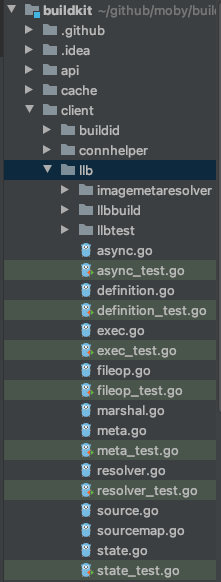
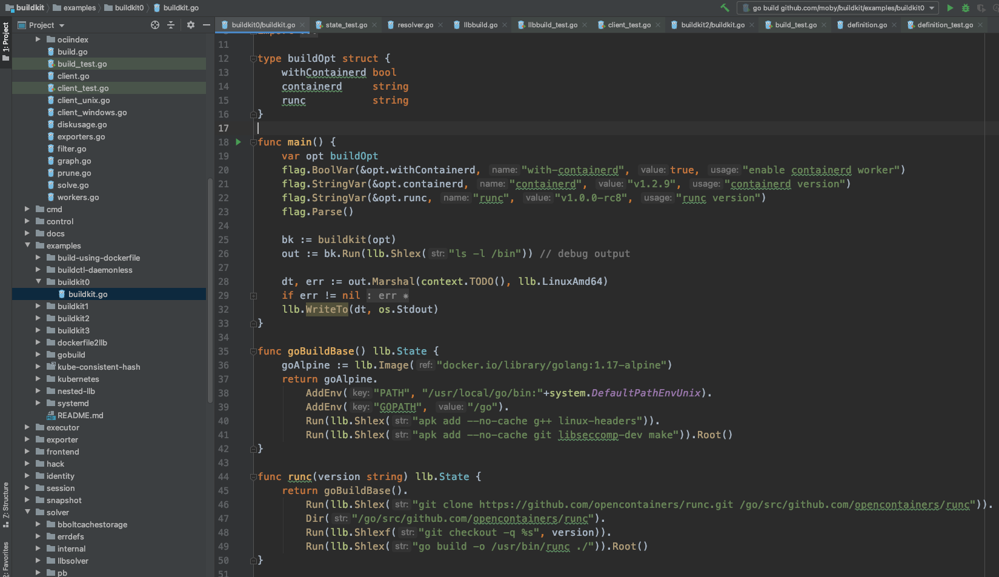

# LLB第一印象

转眼一周就过去了，周五的例会上袁小白分享了这一周的曲折经历，和对代码结构的理解。
龙飞也进行了补充。
贾大智看到大家的热情，对两人赞不绝口。
但没有太多关于代码的更新，这让袁小白心生不满。
心想，我和龙飞都花了这么多时间在代码上，大家都有不错的进展，而你代码相关的，一点更新都没有，这不公平啊。

周未袁小白闲着无聊，脑海里又浮现了龙飞提出来的问题：
**数据结构之间的关系到底是什么样的？**

带着这个问题，袁小白想到，目前看到了dockerfile.build，在这里面出现了三个地方是和数据相关的。

一个是将dockerfile转换成src，虽然还没有看这里的实现细节，看起来好像是将dockerfile转换成了llb语言：

还有一个就是dockerfiel2llb.Dockerfile2LLB:

这里不禁让袁小白有点困惑，前面不是已经转了吗，为什么这个地方还又再转一次？难道两次不一样？

最后这个地方也来源自dockerfile2llb.Dockerfile2LLB，因为这里有一个依赖条件，那就是参数中的**dtDockerfile**这个[]byte类型，将硬盘上的dockerfile加载到了内存空间，那这个又是在哪里准备的呢？

虽然找到了这些信息是如何读取的，解决了一个问题。
但是又出现了三个问题：
为什么这里又要c.Solve一下？
为什么要取出res.SingleRef？
ref又是什么？

虽然现在问题不少，但最让袁小白想了解的，还是这个神秘的LLB，因为所有的问题似乎都与这个LLB有某种联系，LLB究竟是干什么的呢？

目前对LLB的了解，似乎接近于零，因为哪怕是从贾大智对大致架构的[解读](https://juejin.cn/post/7028192294016647182)，都没有提到这一块。
这真是让人难以相信，这么重要的模块居然没有说明！

袁小白很快便找到了llb位置所在，位于client包下：

看着这么多的新文件，这让袁小白感觉又进入了另一个元宇宙...

不过让人开心的是，这里有很多以_test结尾的文件，习惯了TDD（Test Driven Development - 测试驱动开发）后，感觉测试就是另一种类型的文档，不仅能说明很多信息，还可以用来执行，解答疑惑。

但袁小白很快发现，这些都是一些局部的测试，并没有让自己有一个全局的理解，LLB到底是干什么的？
通过全局查找，袁小白似乎看到了希望：

在buildkit0这个例子中，正好讲的就是LLB的使用方法，看起来好像是将dockerfile中一行行的指令用另一种形式组织起来，并且可以同时梳理出多个dockerfile之间的关联！

