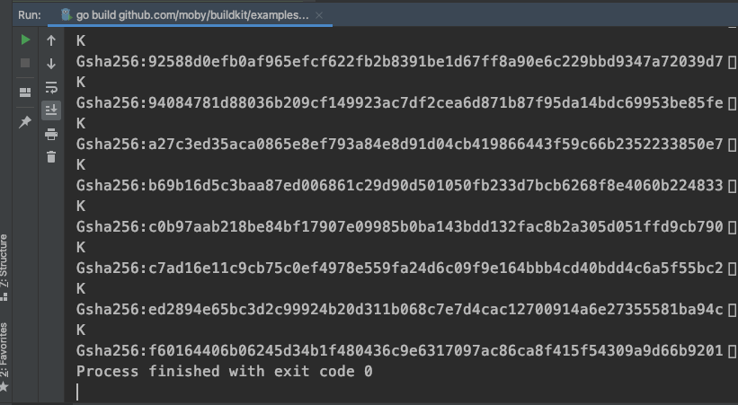

# LLB简单不简单


找到这个用例`examples/buildkit0/buildkit.go`之后，袁小白精神为之一振，试了运行了一下测试，可以跑通：



虽然从结果来看，好像没有太多信息，但这说明可以借助一些日志信息帮助理解，信心也就变得更足了。

## main
```golang
func main() {
   var opt buildOpt
   flag.BoolVar(&opt.withContainerd, "with-containerd", true, "enable containerd worker")
   flag.StringVar(&opt.containerd, "containerd", "v1.2.9", "containerd version")
   flag.StringVar(&opt.runc, "runc", "v1.0.0-rc8", "runc version")
   flag.Parse()

   bk := buildkit(opt)
   out := bk.Run(llb.Shlex("ls -l /bin")) // debug output

   dt, err := out.Marshal(context.TODO(), llb.LinuxAmd64)
   if err != nil {
      panic(err)
   }
   llb.WriteTo(dt, os.Stdout)
}
```
* 首先设置参数，有布尔类型和字符类型，用来说明用不用`containerd`以及`containerd`和`runc`的版本信息。据袁小白所知，containerd是CNCF提供的容器运行管理工具，而runc则是容器运行时工具。
* 用配置选项opt初始化buildkit。
* 接着用初始化好的buildkit运行脚本命令`ls -l /bin`，列出所有在/bin目录下的文件
* 以linux操作系统，amd64架构标准，整顿Marshal整个数据结构，并生成dt(Definition)
* 最后将结果输出到标准输出os.Stdout

## goBuildBase
`buildkit`方法，依赖于goBuildBase，用来创建src，也就是源镜像
```golang
func goBuildBase() llb.State {
   goAlpine := llb.Image("docker.io/library/golang:1.17-alpine")
   return goAlpine.
      AddEnv("PATH", "/usr/local/go/bin:"+system.DefaultPathEnvUnix).
      AddEnv("GOPATH", "/go").
      Run(llb.Shlex("apk add --no-cache g++ linux-headers")).
      Run(llb.Shlex("apk add --no-cache git libseccomp-dev make")).Root()
}
```
* llb.Image创建goAlpine，创建一个镜像实例，并指明ref索引
* 在goAlpine镜像基础上，添加环境变量，及运行命令行安装相关的依赖
可以理解为创建一个设置好环境的golang基础容器

## copy
`buildkit`里，相对复杂的操作就是copy操作：
```golang
func copy(src llb.State, srcPath string, dest llb.State, destPath string) llb.State {
   cpImage := llb.Image("docker.io/library/alpine:latest")
   cp := cpImage.Run(llb.Shlexf("cp -a /src%s /dest%s", srcPath, destPath))
   cp.AddMount("/src", src)
   return cp.AddMount("/dest", dest)
}
```
* 创建一个专门用来拷贝的基础镜像，完全不用安装什么依赖
* 运行操作，将源目录下的文件都拷贝到目标目录
* 挂载源目录
* 挂载目录目录，并返回挂载结果
入参里除了srcPath, destPath外，还有src, dest，并且都是llb.State类型，说明copy操作可以在llb.State级别进行操作，假设src, dest不属于同一个镜像，那就意味着，我们可以用llb.State来表明不同镜像间的操作关系，那这将是现在的dockerfile做不到的。
看到这里，袁小白突然进一步理解了，buildkit的定位 - 未来的镜像构建工具。

## runc
在看`buildkit`前，最后来看看其中的一个操作`runc`:
```golang
func runc(version string) llb.State {
   return goBuildBase().
      Run(llb.Shlex("git clone https://github.com/opencontainers/runc.git /go/src/github.com/opencontainers/runc")).
      Dir("/go/src/github.com/opencontainers/runc").
      Run(llb.Shlexf("git checkout -q %s", version)).
      Run(llb.Shlex("go build -o /usr/bin/runc ./")).Root()
}
```
和上面的类似，基于golang基础镜像，下载runc源码，进入源码目录，切换到指定版本，最后构建runc可运行二进制文件，并输出到./当前目录下，返回root目录llb.State

## buildkit
```golang
func buildkit(opt buildOpt) llb.State {
   src := goBuildBase().
      Run(llb.Shlex("git clone https://github.com/moby/buildkit.git /go/src/github.com/moby/buildkit")).
      Dir("/go/src/github.com/moby/buildkit")

   buildkitdOCIWorkerOnly := src.
      Run(llb.Shlex("go build -o /bin/buildkitd.oci_only -tags no_containerd_worker ./cmd/buildkitd"))

   buildkitd := src.
      Run(llb.Shlex("go build -o /bin/buildkitd ./cmd/buildkitd"))

   buildctl := src.
      Run(llb.Shlex("go build -o /bin/buildctl ./cmd/buildctl"))

   r := llb.Image("docker.io/library/alpine:latest")
   r = copy(buildctl.Root(), "/bin/buildctl", r, "/bin/")
   r = copy(runc(opt.runc), "/usr/bin/runc", r, "/bin/")
   if opt.withContainerd {
     ...
   } else {
      r = copy(buildkitdOCIWorkerOnly.Root(), "/bin/buildkitd.oci_only", r, "/bin/")
   }
   return r
}
```
* 创建buildkit源golang环境镜像，`git clone`buildkit源码，并进入到源码目录
* 基于源构建buildkitd.oci_only二进制文件
* 基于源构建buildkitd二进制文件
* 基于源构建buildctl二进制文件
* 创建一个空的镜像
* 将buildctl二进制文件，从上面拷贝到这个新创建的镜像/bin/目录下
* 将runc二进制文件，从上面拷贝到/bin目录下
* 假设我们没有设置containerd，那接下来的操作就是将buildkitd.oci_only二进制文件，拷贝到/bin目录下

那最后当我们进行`ls -l /bin`脚本时，显示的结果里就有buildctl, runc, buildkitd.oci_only这三个文件了。

可是从最上面的输出来看，好像并不是运行完后的结果，更像是中间过程，也就是Definition。
整体来看，我可以用一个镜像来构建buildkit全家桶 - buildctl, buildkitd, buildkitd.oci_only。
然后用一个镜像来准备runc命令行工具。
并用一个全新的镜像来执行copy操作。
最后用一个干净的镜像来持有所有创建好的工具。

这下袁小白的好奇心算是彻底地被勾了起来：
* LLB是怎么把这些构建关系给组织起来的呢？
* llb.State是怎么工作的呢？
* 如果只是中间状态，那这个Definition和llb.State的关系又是什么呢？Definition是最终状态吗？
* 这里面有一些步骤可以同时运行，那如何高效的执行这些操作，和理清这些依赖呢？

袁小白越想越兴奋 - LLB用起来还挺简单的，一看就明白，可实现起来，好像还真不简单！
