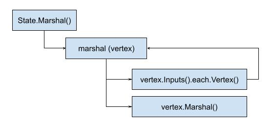

# Definition

袁小白听贾大智提到过，读文章可以沿着文章的主线来读。
代码也一样，也有自己的脉络，其中一种方法就是按数据的流向来理解源码。
到目前为止，从`buildctl build`来看，按顺序出现过的数据有dockerfile，llb.State，现在又有了Definition。
dockerfile如何读取并转化为llb.State，咱们可以回头再看。
llb.State的工作原理我们已经梳理过了。
现在这个Definition又要怎么理解呢？

带着这样的问题，袁小白好奇的打开了源码，读了起来。
```golang
func (s State) Marshal(ctx context.Context, co ...ConstraintsOpt) (*Definition, error) {
   def := &Definition{
      Metadata: make(map[digest.Digest]pb.OpMetadata, 0),
   }
   ...
}
```
函数一开始定义了一个空的Definition，看来数据都会被存在这里面。

```golang
// Definition is the LLB definition structure with per-vertex metadata entries
// Corresponds to the Definition structure defined in solver/pb.Definition.
type Definition struct {
   Def      [][]byte
   Metadata map[digest.Digest]pb.OpMetadata
   Source   *pb.Source
}
```
Definition的结构体看起来也不复杂，只有三项，后面两项都是自定义的类型，且以pb开头，那这个pb又是什么呢？
原来这是`solver`下的pb，从`ops.proto`中可以看出，原来这就是google的[Protocol Buffers](https://developers.google.com/protocol-buffers/docs/proto3)，看了下文档后，大概的意思说是用来传输数据用的，特点是压缩算法很高效，专为数据传输场景打造的语言。
那我们这里可以预见的就是，我们的Definition可能多少需要跨网传输到远端进行处理。

再看下一句：
```golang
func (s State) Marshal(ctx context.Context, co ...ConstraintsOpt) (*Definition, error) {
   def := &Definition{
      Metadata: make(map[digest.Digest]pb.OpMetadata, 0),
   }
   ...
   def, err := marshal(ctx, s.Output().Vertex(ctx, c), def, smc, map[digest.Digest]struct{}{}, map[Vertex]struct{}{}, c)
   ...
}
```
这里又来了个小写的marshal，从参数来看，第二个是s.Output().Vertex(...)，基于现在的理解，这个就是上次看到的ExecState，也就是第二部分。
def也传了进去，看来猜想的没错，确实是用来存储数据的。

再看小marshal：
```golang
func marshal(ctx context.Context, v Vertex, def *Definition, s *sourceMapCollector, cache map[digest.Digest]struct{}, vertexCache map[Vertex]struct{}, c *Constraints) (*Definition, error) {
   if _, ok := vertexCache[v]; ok {
      return def, nil
   }
   for _, inp := range v.Inputs() {
      var err error
      def, err = marshal(ctx, inp.Vertex(ctx, c), def, s, cache, vertexCache, c)
      if err != nil {
         return def, err
      }
   }

   dgst, dt, opMeta, sls, err := v.Marshal(ctx, c)
   if err != nil {
      return def, err
   }
   vertexCache[v] = struct{}{}
   if opMeta != nil {
      def.Metadata[dgst] = mergeMetadata(def.Metadata[dgst], *opMeta)
   }
   if _, ok := cache[dgst]; ok {
      return def, nil
   }
   s.Add(dgst, sls)
   def.Def = append(def.Def, dt)
   cache[dgst] = struct{}{}
   return def, nil
}
```
可以看出这里有一个递归调用小marshal，如果v.Inputs()不为空，那么就会触发递归：



贾大智还说过，看递归，主要看两点，一个是抽象出递规函数要做的事情，也就是会重复被调用的动作，再就是看出口，也就是退出递归的地方。

这里正好可以试验下这种方法：
- 递归函数就是小marshal，主要是用来将Vertex整理成对应的Definition。
- 出口就是v.Inputs()，也就是一直会找到没有Inputs的结点开始处理，那我们这里就是SourceOp，他是第一个Vertex，再没有input了。
会一直向上查找，找到最后没有依赖的结点，开始处理，似乎就是传说中的深度优先算法。

那具体是如何转换的呢？
得到下一句：
```golang
dgst, dt, opMeta, sls, err := v.Marshal(ctx, c)
```
这里的v，就是我们的Vertex，我们现在有SourcOp, ExecOp，我们来看看他们大Marshal是如何实现的.
## SourceOp Marshal()
```golang
func (s *SourceOp) Marshal(ctx context.Context, constraints *Constraints) (digest.Digest, []byte, *pb.OpMetadata, []*SourceLocation, error) {
   if s.Cached(constraints) {
      return s.Load()
   }
   if err := s.Validate(ctx, constraints); err != nil {
      return "", nil, nil, nil, err
   }

   if strings.HasPrefix(s.id, "local://") {
      if _, hasSession := s.attrs[pb.AttrLocalSessionID]; !hasSession {
         uid := s.constraints.LocalUniqueID
         if uid == "" {
            uid = constraints.LocalUniqueID
         }
         s.attrs[pb.AttrLocalUniqueID] = uid
         addCap(&s.constraints, pb.CapSourceLocalUnique)
      }
   }
   proto, md := MarshalConstraints(constraints, &s.constraints)

   proto.Op = &pb.Op_Source{
      Source: &pb.SourceOp{Identifier: s.id, Attrs: s.attrs},
   }

   if !platformSpecificSource(s.id) {
      proto.Platform = nil
   }

   dt, err := proto.Marshal()
   if err != nil {
      return "", nil, nil, nil, err
   }

   s.Store(dt, md, s.constraints.SourceLocations, constraints)
   return s.Load()
}
```
可以看到`proto, md := MarshalConstraints(constraints, &s.constraints)`生成了proto：
```golang
return &pb.Op{
   Platform: &pb.Platform{
      OS:           c.Platform.OS,
      Architecture: c.Platform.Architecture,
      Variant:      c.Platform.Variant,
      OSVersion:    c.Platform.OSVersion,
      OSFeatures:   c.Platform.OSFeatures,
   },
   Constraints: &pb.WorkerConstraints{
      Filter: c.WorkerConstraints,
   },
}, &c.Metadata
```
也就是在这里，从SourceOp转换成了pb.Op：
```golang
proto.Op = &pb.Op_Source{
   Source: &pb.SourceOp{Identifier: s.id, Attrs: s.attrs},
}
```

## ExecOp Marshal()
主流程和SourceOp类似，实际处理的流程要复杂一些，我们先专注在数据的转换上：
```golang
func (e *ExecOp) Marshal(ctx context.Context, c *Constraints) (digest.Digest, []byte, *pb.OpMetadata, []*SourceLocation, error) {
   ...
   pop, md := MarshalConstraints(c, &e.constraints)
   pop.Op = &pb.Op_Exec{
      Exec: peo,
   }
   ...
   
```
从整体来看，数据转换流程确实变得清楚了一些。
用深度优先递归组织好所有的Vertex，这里得感谢llb.State帮我们组织好了Vertex之间的关系。
然后每一个Op，也就是SourceOp和ExecOp，而且都提供了Marshal方法，真正做数据转换的地方，加上Proto Buffer的加持，具体的序列化操作并不需要我们操心。
这样我们就完成了llb.State到Definition的转换，其中所有的SourceOp, ExecOp临时Op，转换成了标准的pb.Op。

感觉不错，袁小白高高兴兴的准备出门上班了 ：）
