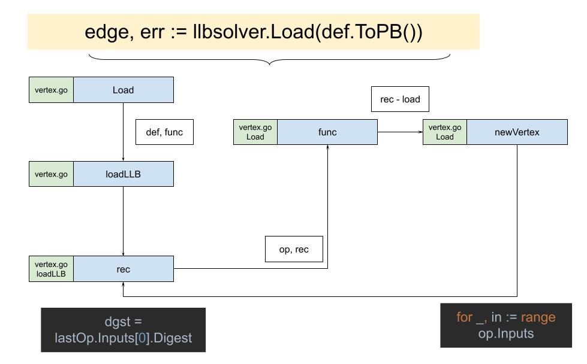

# Edge

梳理完了数据三剑客中的State和Definition后，现在就差Edge了。
袁小白找回到代码之前读到的位置：`client/llb/llbtest/platform_test.go - TestDefaultPlatform`，正好看到了:
```golang
e, err := llbsolver.Load(def.ToPB())
```
返回的结果正好是Edge。

## def.ToPB()
```golang
func (def *Definition) ToPB() *pb.Definition {
   md := make(map[digest.Digest]pb.OpMetadata, len(def.Metadata))
   for k, v := range def.Metadata {
      md[k] = v
   }
   return &pb.Definition{
      Def:      def.Def,
      Source:   def.Source,
      Metadata: md,
   }
}
```
没有什么复杂的操作，就是将Definition转化为pb.Definition。
甚至有一点奇怪，因为这两个对象实在是太像了，简直就是一模一样。
那问题来了，为什么要创造两个而不是一个呢？
带着这个问题，袁小白继续看起了重点内容：`llbsolver.Load`。

## Load
```golang
func Load(def *pb.Definition, opts ...LoadOpt) (solver.Edge, error) {
   return loadLLB(def, func(dgst digest.Digest, pbOp *pb.Op, load func(digest.Digest) (solver.Vertex, error)) (solver.Vertex, error) {
      opMetadata := def.Metadata[dgst]
      vtx, err := newVertex(dgst, pbOp, &opMetadata, load, opts...)
      if err != nil {
         return nil, err
      }
      return vtx, nil
   })
}
```
主要是接收pb.Definition，调用loadLLB函数。

## loadLLB
```golang
// loadLLB loads LLB.
// fn is executed sequentially.
func loadLLB(def *pb.Definition, fn func(digest.Digest, *pb.Op, func(digest.Digest) (solver.Vertex, error)) (solver.Vertex, error)) (solver.Edge, error) {
   if len(def.Def) == 0 {
      return solver.Edge{}, errors.New("invalid empty definition")
   }

   allOps := make(map[digest.Digest]*pb.Op)

   var dgst digest.Digest

   for _, dt := range def.Def {
      var op pb.Op
      if err := (&op).Unmarshal(dt); err != nil {
         return solver.Edge{}, errors.Wrap(err, "failed to parse llb proto op")
      }
      dgst = digest.FromBytes(dt)
      allOps[dgst] = &op
   }

   if len(allOps) < 2 {
      return solver.Edge{}, errors.Errorf("invalid LLB with %d vertexes", len(allOps))
   }
   ... 
}
```
首先根据pb.Definition将def.Def转换成pb.Op，并存放在allOps中。

```golang
// loadLLB loads LLB.
// fn is executed sequentially.
func loadLLB(def *pb.Definition, fn func(digest.Digest, *pb.Op, func(digest.Digest) (solver.Vertex, error)) (solver.Vertex, error)) (solver.Edge, error) {
   ...

   lastOp := allOps[dgst]
   delete(allOps, dgst)
   if len(lastOp.Inputs) == 0 {
      return solver.Edge{}, errors.Errorf("invalid LLB with no inputs on last vertex")
   }
   dgst = lastOp.Inputs[0].Digest

   ...
}
```
中间部分值得我们关系的是取出了最后一个Op - lastOp，的第一个Input依赖 - lastOp.Inputs[0].Digest。
这里要注意的是，在Definition中最后一个Op是用来辅助逻辑的，并没有和真正的Op对应上，就像树状结构的根，而Inputs[0]再是真正意义上最后的一个Op，可以参考Definition代码：
```golang
func (s State) Marshal(ctx context.Context, co ...ConstraintsOpt) (*Definition, error) {
   ...

   def, err := marshal(ctx, s.Output().Vertex(ctx, c), def, smc, map[digest.Digest]struct{}{}, map[Vertex]struct{}{}, c)
   if err != nil {
      return def, err
   }
   inp, err := s.Output().ToInput(ctx, c)
   if err != nil {
      return def, err
   }
   proto := &pb.Op{Inputs: []*pb.Input{inp}}
   dt, err := proto.Marshal()
   if err != nil {
      return def, err
   }
   def.Def = append(def.Def, dt)
   ...
}
```
上面所指，就是`proto := &pb.Op{Inputs: []*pb.Input{inp}}`，最后创建了一个新的pb.Op，但实际上并没有设置其它属性，只有Inputs。

再接着看`loadLLB`：
```golang
// loadLLB loads LLB.
// fn is executed sequentially.
func loadLLB(def *pb.Definition, fn func(digest.Digest, *pb.Op, func(digest.Digest) (solver.Vertex, error)) (solver.Vertex, error)) (solver.Edge, error) {
   ...

   cache := make(map[digest.Digest]solver.Vertex)

   var rec func(dgst digest.Digest) (solver.Vertex, error)
   rec = func(dgst digest.Digest) (solver.Vertex, error) {
      if v, ok := cache[dgst]; ok {
         return v, nil
      }
      op, ok := allOps[dgst]
      if !ok {
         return nil, errors.Errorf("invalid missing input digest %s", dgst)
      }

      if err := ValidateOp(op); err != nil {
         return nil, err
      }

      v, err := fn(dgst, op, rec)
      if err != nil {
         return nil, err
      }
      cache[dgst] = v
      return v, nil
   }

   v, err := rec(dgst)
   if err != nil {
      return solver.Edge{}, err
   }
   return solver.Edge{Vertex: v, Index: solver.Index(lastOp.Inputs[0].Index)}, nil
}
```
最后用内嵌的函数`rec`，调用传入的`fn`，并且将自己作为了参数传入，fn就是上面传入的：
```golang
func(dgst digest.Digest, pbOp *pb.Op, load func(digest.Digest) (solver.Vertex, error)) (solver.Vertex, error) {
   opMetadata := def.Metadata[dgst]
   vtx, err := newVertex(dgst, pbOp, &opMetadata, load, opts...)
   if err != nil {
      return nil, err
   }
   return vtx, nil
}
```
可以看出，这个函数，就是传入newVertex调用所需的上下文。

## newVertex
```golang
func newVertex(dgst digest.Digest, op *pb.Op, opMeta *pb.OpMetadata, load func(digest.Digest) (solver.Vertex, error), opts ...LoadOpt) (*vertex, error) {
   opt := solver.VertexOptions{}
   if opMeta != nil {
      opt.IgnoreCache = opMeta.IgnoreCache
      opt.Description = opMeta.Description
      if opMeta.ExportCache != nil {
         opt.ExportCache = &opMeta.ExportCache.Value
      }
   }
   for _, fn := range opts {
      if err := fn(op, opMeta, &opt); err != nil {
         return nil, err
      }
   }

   vtx := &vertex{sys: op, options: opt, digest: dgst, name: llbOpName(op)}
   for _, in := range op.Inputs {
      sub, err := load(in.Digest)
      if err != nil {
         return nil, err
      }
      vtx.inputs = append(vtx.inputs, solver.Edge{Index: solver.Index(in.Index), Vertex: sub})
   }
   return vtx, nil
}
```
主要目的就是创建vertex，但值得注意的是在op.Inputs的循环中，又调用了传入的`load()`，这个load就是上面的`rec`。



没错，这里又出现了递归。
像之前理解递归一样，我们需要关注两点：
* 递归函数的目的就是创建vertex
* 递归出口就是没有input的op，也就是我们的SourceOp

```golang
// loadLLB loads LLB.
// fn is executed sequentially.
func loadLLB(def *pb.Definition, fn func(digest.Digest, *pb.Op, func(digest.Digest) (solver.Vertex, error)) (solver.Vertex, error)) (solver.Edge, error) {
   ...
   v, err := rec(dgst)
   if err != nil {
      return solver.Edge{}, err
   }
   return solver.Edge{Vertex: v, Index: solver.Index(lastOp.Inputs[0].Index)}, nil
}
```
得到rec返回的v-vertex后，我们返回了solver.Edge，可以看出，这个Edge只是一个连接点，是Vertex的补充说明。

终于，集齐了State, Definition, Edge。
那么，是否到了召唤神龙的时刻了呢？
袁小白成就感满满的吸了口气。
