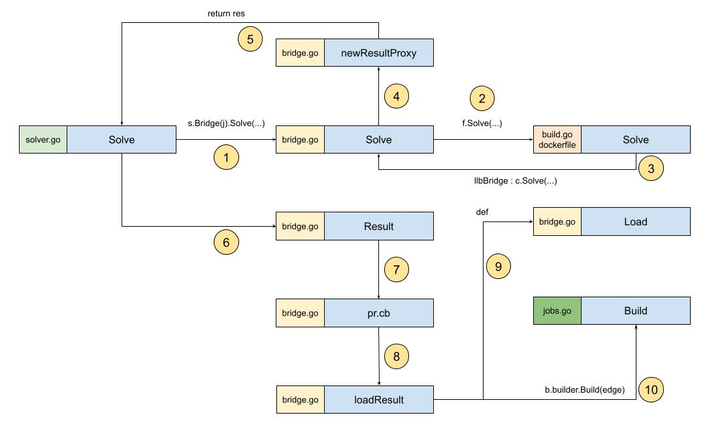

# 是时候开始Build了

为了加强自己的理解，袁小白像以往一样，梳理了下流程图：



1. solver接受到请求后，在Solve方法中调用Bridge的Solve方法，开始解析
2. 在bridge中调用Frontend进行解析，这里的Frontend就是dockerfile
3. 在dockerfile Frontend中，又调用了bridge的Solve方法，这一次和第一步不一样的地方在于传入的参数，这一次是传入了已经解析好的Definition
4. 创建代理结果，因为这个时候并没有得到真正的构建结果，只是把中间所需要的对象都组织好，比如这里准备的实际上是frontend.Result.Ref
5. 准备好newResultProxy，返回第一步Solve的结果res
6. 得到Frontend Solve的结果res后，加载代理结果的Result
7. 实际调用的是创建代码结果的回调函数pr.cb - proxyResult.callBack
8. 代理结果中实际请求的是llbBridge.loadResult
9. loadResult中先调用的是Load，注意，这里的Load和我们之前见到的一样，是将Definition转换为Edge。这里Edge第一次出现了
10. 真正的Build开始了，而且出现了一个新的文件 - jobs.go

源码是：
```golang
res, bi, err := b.builder.Build(ctx, edge)
```
b就是llbBridge实例，那b.builder是什么呢？
从上面流程图中可以知道，在第一步时，solver的Solve方法中，调用了Bridge的Solve：
```golang
res, err = s.Bridge(j).Solve(ctx, req, sessionID)
```
这里是bridge实例化的地方：
```golang
func (s *Solver) Bridge(b solver.Builder) frontend.FrontendLLBBridge {
   return &llbBridge{
      builder:                   b,
      frontends:                 s.frontends,
      resolveWorker:             s.resolveWorker,
      eachWorker:                s.eachWorker,
      resolveCacheImporterFuncs: s.resolveCacheImporterFuncs,
      cms:                       map[string]solver.CacheManager{},
      sm:                        s.sm,
   }
}
```
传入的参数就是就是builder，再看这个`j`：
```golang
j, err := s.solver.NewJob(id)
```
再继续展开：
```golang
func (jl *Solver) NewJob(id string) (*Job, error) {
   jl.mu.Lock()
   defer jl.mu.Unlock()

   if _, ok := jl.jobs[id]; ok {
      return nil, errors.Errorf("job ID %s exists", id)
   }

   pr, ctx, progressCloser := progress.NewContext(context.Background())
   pw, _, _ := progress.NewFromContext(ctx) // TODO: expose progress.Pipe()

   _, span := trace.NewNoopTracerProvider().Tracer("").Start(ctx, "")
   j := &Job{
      list:           jl,
      pr:             progress.NewMultiReader(pr),
      pw:             pw,
      progressCloser: progressCloser,
      span:           span,
      id:             id,
   }
   jl.jobs[id] = j

   jl.updateCond.Broadcast()

   return j, nil
}
```
可以看到，这里有一个list，用来存储新创建的job，返回的j中有对应的list引用。
在返回前我们还看到了`jl.updateCond.Broadcast()`，应该是向组内其它job进行广播，有新成员加入了。

绕了一圈回来，我们找到了真正Build开始的地方 - jobs.Build：
```golang
func (j *Job) Build(ctx context.Context, e Edge) (CachedResult, BuildInfo, error) {
   if span := trace.SpanFromContext(ctx); span.SpanContext().IsValid() {
      j.span = span
   }

   v, err := j.list.load(e.Vertex, nil, j)
   if err != nil {
      return nil, nil, err
   }
   e.Vertex = v

   res, err := j.list.s.build(ctx, e)
   if err != nil {
      return nil, nil, err
   }

   j.list.mu.Lock()
   defer j.list.mu.Unlock()
   return res, j.walkBuildInfo(ctx, e, make(BuildInfo)), nil
}
```
其中有两句吸引了袁小白的注意：
* j.list.load
* j.list.s.build

不知道要用什么样的姿势，才能正确打开jobs的load和s.build
