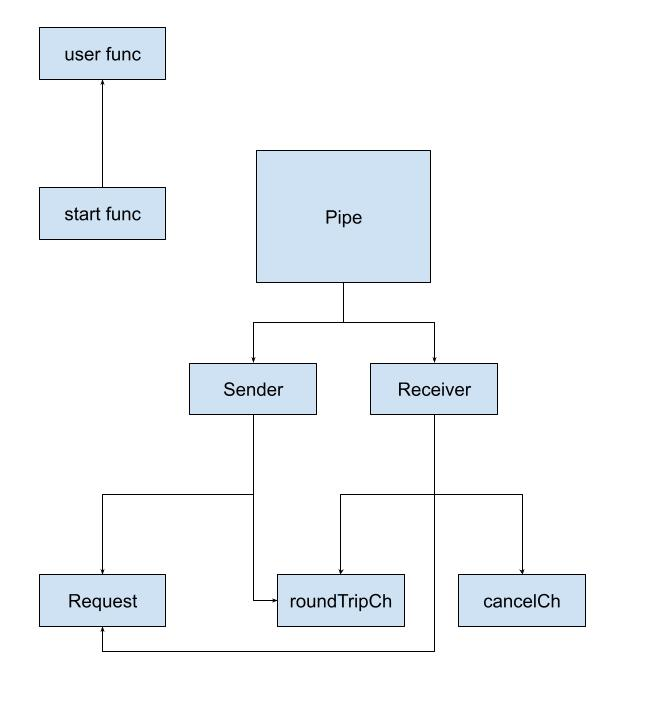
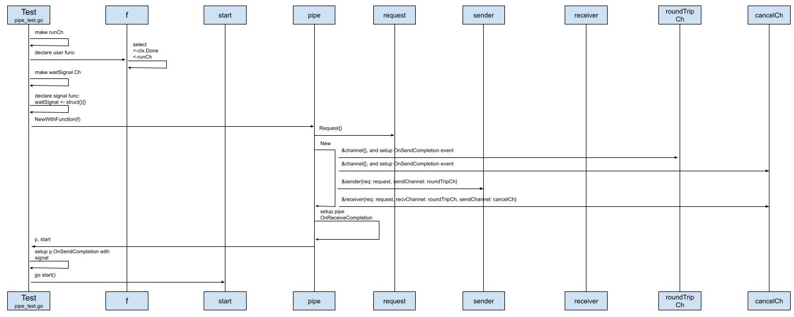
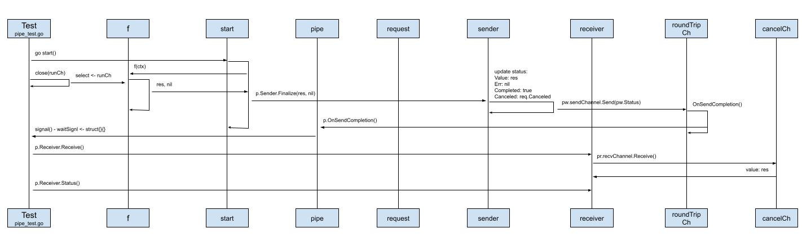
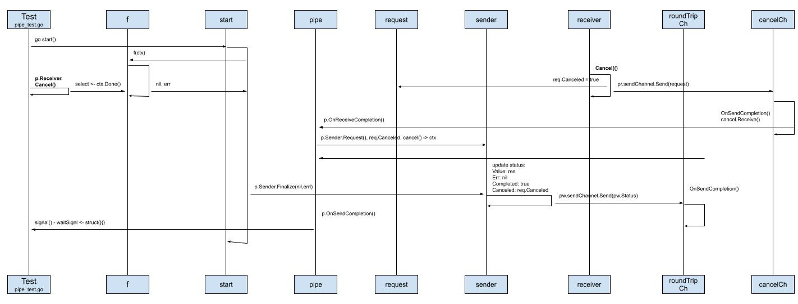

# Pipe设计原理

袁小白也看过类似的设计模式，如pipe。
大体的思路就是抽象出运行操作的环境，有输入，有输出。
将操作的执行有序的衔接起来。
如果想要做得灵活一点，输入和输出可以不用统一，甚至可以自定义。
不过再一想之前看到的设计模式，通常是同步的操作，也就是操作本身并不复杂，只不过需要有序的将各操作串联起来，并提供通用功能的支持，比如输入输出的较验等。

那用golang如何实现一个可支持中断操作的管道pipe功能呢？
袁小白的好奇心又一次跳了出来。



目前，对于pipe的构成有了一定的了解，那究竟buildkit是如何设计和实现这个pipe的呢？
带着这个疑问，袁小白开始梳理起了模块之间的时序图。

## Pipe前期准备之初始化


* 创建一个channel - runCh，和用户自定义function配合使用，如我们的可阻塞函数，我们在等待runCh的写入，这样我们就可以返回结果"res0"
```golang
f := func(ctx context.Context) (interface{}, error) {
   select {
   case <-ctx.Done():
      return nil, ctx.Err()
   case <-runCh:
      return "res0", nil
   }
}
```
* 创建waitSignal信道，这样我做一些自己想做的事情，当signal被触发时，这里的时机就是pipe.OnSendCompletion
```golang
waitSignal := make(chan struct{}, 10)
signalled := 0
signal := func() {
   signalled++
   waitSignal <- struct{}{}
}

p, start := NewWithFunction(f)
p.OnSendCompletion = signal
```
* 传入用户自定义函数，创建管道pipe。从返回结果来看，我们得到一个pipe和一个start函数
```golang
return p, func() {
   res, err := f(ctx)
   if err != nil {
      p.Sender.Finalize(nil, err)
      return
   }
   p.Sender.Finalize(res, nil)
}
```
可以看到，这里是我们自定义的函数真正被调用的地方。
并且pipe还调用了Sender.Finalize方法。

* 真正创建Pipe实例的函数是`New`：
```golang
func New(req Request) *Pipe {
   cancelCh := &channel{}
   roundTripCh := &channel{}
   pw := &sender{
      req:         req,
      sendChannel: roundTripCh,
   }
   pr := &receiver{
      req:         req,
      recvChannel: roundTripCh,
      sendChannel: cancelCh,
   }

   p := &Pipe{
      Sender:   pw,
      Receiver: pr,
   }

   cancelCh.OnSendCompletion = func() {
      v, ok := cancelCh.Receive()
      if ok {
         pw.setRequest(v.(Request))
      }
      if p.OnReceiveCompletion != nil {
         p.OnReceiveCompletion()
      }
   }

   roundTripCh.OnSendCompletion = func() {
      if p.OnSendCompletion != nil {
         p.OnSendCompletion()
      }
   }

   return p
}
```
这里正是sender, receiver, pipe创建的地方。
值得我们关注的地方还有cancel.OnSendCompletion和roundTripCh.OnSendCompletion，它们分别会调用p.OnReceiveCompletion和p.OnSendCompletion生命周期函数。
而这里正是channel和pipe之前进行交付的地方。
最后就是receiver和sender都持有roundTripCh，但不同的是，roundTripCh对于receiver而言是recvChannel，而对于sender而言，是sendChannel，这里就是管道连接建立的地方，一端负责写send，另一端负责读recv。

* 准备执行start - `go start()`，基于对goroutine的了解，通常这并不会立马得到运行时的实际调用，因为切换goroutine还是有成本的，虽然相对切换线程的成本小，但并不是完全没有。接下来的验证进一步佐证了袁小白的猜测：
```golang
go start()
require.Equal(t, false, p.Receiver.Receive())

st := p.Receiver.Status()
require.Equal(t, st.Completed, false)
require.Equal(t, st.Canceled, false)
require.Nil(t, st.Value)
require.Equal(t, signalled, 0)
```

## Pipe happy path - 正常流程
 
正常流程就是我们搭建好了pipe管道，并执行，得到我们期待的结果，一切都很顺利。

* 准备正常返回，也就是runCh信道正常收到消息 - `close(runCh)`，比如http请求的异步请求正常返回；然后当前goroutine进入阻塞 - `<-waitSignal`，监听信号，等待被唤醒：
```golang
close(runCh)
<-waitSignal
```

* start函数正式被执行，用户自定义函数被调用，并返回结果"res"；触发p.Sender.Finalize
* 而Sender在Finalize函数中所做的事情有两件，一件是更新status的属性，如Value: res, Err: nil, Completed: true, Canceled: req.Canceled false；另一件就是调用sendChannel发送刚刚更新好的status，像之前提到的,sender的sendChannel就是共用的roundTripChannel：
```golang
func (c *channel) Send(v interface{}) {
   c.value.Store(&wrappedValue{value: v})
   if c.OnSendCompletion != nil {
      c.OnSendCompletion()
   }
}
```

* sendChannel的Send方法，又调用了提前设置好的OnSendCompletion事件：
```golang
roundTripCh.OnSendCompletion = func() {
   if p.OnSendCompletion != nil {
      p.OnSendCompletion()
   }
}
```
实际调用的就是pipe的OnSendCompletion事件，而这个事件正是在测试中设置好的signal函数：
```golang
signal := func() {
   signalled++
   waitSignal <- struct{}{}
}
```
对计数器进行累加操作。
并写入waitSignal信道。
这样就唤醒了等待waitSignal信道更新的其它goroutine，这里指的是我们的测试 - main goroutine。

* 再次调用p.Receiver.Status时，得到的就是我们所期待的结果：
```golang
p.Receiver.Receive()
st = p.Receiver.Status()
require.Equal(t, st.Completed, true)
require.Equal(t, st.Canceled, false)
require.NoError(t, st.Err)
require.Equal(t, st.Value.(string), "res0")
```

## pipe 取消流程

和正常流程不一样的地方在于，用户主动取消息了pipe操作，调用了`p.Receiver.Cancel()`
```golang
p.Receiver.Cancel()
<-waitSignal
```

* 首先触发的就是Receiver.Cancel操作：
```golang
func (pr *receiver) Cancel() {
   req := pr.req
   if req.Canceled {
      return
   }
   req.Canceled = true
   pr.sendChannel.Send(req)
}
```
更新req的状态。
因为sender和receiver实例都持有了req，所以他们可以共享req信息。
调用sendChannel.Send(req)，因为这里的sendChannel就是之前的cancelCh，当调用channel的Send方法时：
```golang
func (c *channel) Send(v interface{}) {
   c.value.Store(&wrappedValue{value: v})
   if c.OnSendCompletion != nil {
      c.OnSendCompletion()
   }
}
```
也会调用对应的OnSendCompletion操作：
```golang
cancelCh.OnSendCompletion = func() {
   v, ok := cancelCh.Receive()
   if ok {
      pw.setRequest(v.(Request))
   }
   if p.OnReceiveCompletion != nil {
      p.OnReceiveCompletion()
   }
}
```
在这里，又会调用pipe的OnReceiveCompletion操作：
```golang
ctx, cancel := context.WithCancel(context.TODO())

p.OnReceiveCompletion = func() {
   if req := p.Sender.Request(); req.Canceled {
      cancel()
   }
}
```
因为req的Canceled已被设置成true，所以会调用context的cancel方法。
这里正是连接start函数的地方，因为执行自定义函数f时，会传入ctx也就是上下文，这时f(ctx)就会报错。

* 和正常流程不同的是，在调用Sender.finalize的时候，传入的就是nil, err - p.SenderFinalize(nil, err)
* 接下来和正常流程的调用顺序一样，最后会调用signal并唤醒main goroutine，也就是我们的测试函数

得到的结果自然也就是我们期待的：
```golang
p.Receiver.Receive()
st = p.Receiver.Status()
require.Equal(t, st.Completed, true)
require.Equal(t, st.Canceled, true)
require.Error(t, st.Err)
require.Equal(t, st.Err, context.Canceled)
```
