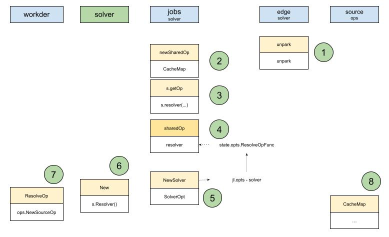
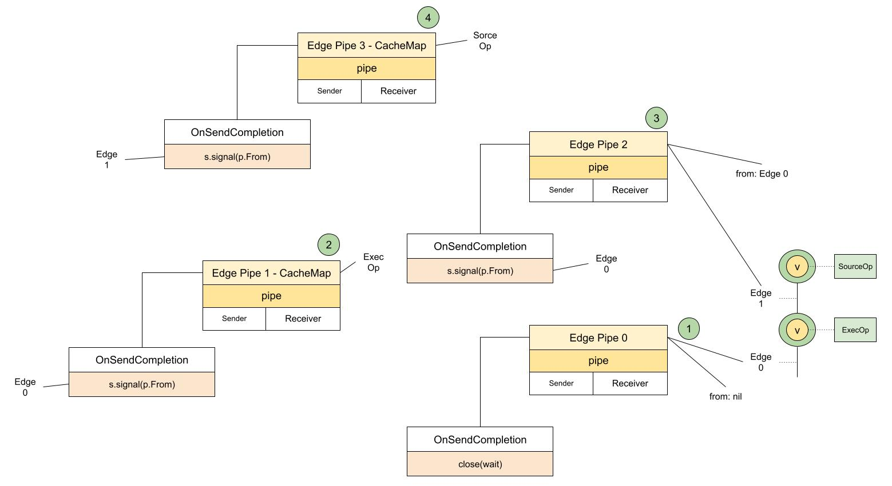

# SourceOp CacheKey

在SourceOp的CacheMap里，需要获取`s.instance`，而这里又依赖于`s.sm.Resolve`，可以看到sm实际上就是source.Manager，依赖于Resolve方法。
没错又一个Resolve，袁小白自言自语到，看来取名字真的很关键，大家都有resolve的话，这理解起来就太容易混淆了。
再看这个Resolve：
```golang
func (sm *Manager) Resolve(ctx context.Context, id Identifier, sessM *session.Manager, vtx solver.Vertex) (SourceInstance, error) {
   sm.mu.Lock()
   src, ok := sm.sources[id.ID()]
   sm.mu.Unlock()

   if !ok {
      return nil, errors.Errorf("no handler for %s", id.ID())
   }

   return src.Resolve(ctx, id, sessM, vtx)
}
```
居然是用数组存起来的：



对照着operation创建的地方，袁小白很快发现SourceOp是在worker中被创建的，那这个source.Manager是不是也在那里预先装载好的呢？

果然，就是在这里：
```golang
// NewWorker instantiates a local worker
func NewWorker(ctx context.Context, opt WorkerOpt) (*Worker, error) {
   ...
   sm, err := source.NewManager()
   if err != nil {
      return nil, err
   }

   is, err := containerimage.NewSource(containerimage.SourceOpt{
      Snapshotter:   opt.Snapshotter,
      ContentStore:  opt.ContentStore,
      Applier:       opt.Applier,
      ImageStore:    opt.ImageStore,
      CacheAccessor: cm,
      RegistryHosts: opt.RegistryHosts,
      LeaseManager:  opt.LeaseManager,
   })
   if err != nil {
      return nil, err
   }

   sm.Register(is)
   ...
}
```
* 首先用source.NewManager创建了source manager实例
* 紧接着注册了新的source - is，也就是container.NewSource实例

为了验证自己的想法，袁小白决定去检查一下这个实例是否有Resolve方法。
结果不出所料，就在这：
```golang
func (is *Source) Resolve(ctx context.Context, id source.Identifier, sm *session.Manager, vtx solver.Vertex) (source.SourceInstance, error) {
   imageIdentifier, ok := id.(*source.ImageIdentifier)
   if !ok {
      return nil, errors.Errorf("invalid image identifier %v", id)
   }

   platform := platforms.DefaultSpec()
   if imageIdentifier.Platform != nil {
      platform = *imageIdentifier.Platform
   }

   pullerUtil := &pull.Puller{
      ContentStore: is.ContentStore,
      Platform:     platform,
      Src:          imageIdentifier.Reference,
   }
   p := &puller{
      CacheAccessor:  is.CacheAccessor,
      LeaseManager:   is.LeaseManager,
      Puller:         pullerUtil,
      id:             imageIdentifier,
      RegistryHosts:  is.RegistryHosts,
      ImageStore:     is.ImageStore,
      Mode:           imageIdentifier.ResolveMode,
      Ref:            imageIdentifier.Reference.String(),
      SessionManager: sm,
      vtx:            vtx,
   }
   return p, nil
}
```
居然返回了个Puller实例，可转过头一想，也对，如果我是一个SourceOp，对应的就是Dockerfile的From指令，如果我要获取这个父容器的信息，自然需要一个对象帮我获取，那这里就会有用来提供存储服务的对象 - ContentStore，和用来提升效率的缓存策略 - CacheAccessor。

Instance是找到了，就是这个Puller，再看这个Instance的CacheKey:
```golang
func (p *puller) CacheKey(ctx context.Context, g session.Group, index int) (cacheKey string, imgDigest string, cacheOpts solver.CacheOpts, cacheDone bool, err error) {
   ...
   _, err = p.g.Do(ctx, "", func(ctx context.Context) (_ interface{}, err error) {
      ...
      p.manifest, err = p.PullManifests(ctx)
      ...
      k, err := mainManifestKey(ctx, desc, p.Platform)
      ...
      p.manifestKey = k.String()
      dt, err := content.ReadBlob(ctx, p.ContentStore, p.manifest.ConfigDesc)
      ...
   })
   ...
   if index == 0 || p.configKey == "" {
      return p.manifestKey, p.manifest.MainManifestDesc.Digest.String(), cacheOpts, cacheDone, nil
   }
   return p.configKey, p.manifest.MainManifestDesc.Digest.String(), cacheOpts, cacheDone, nil
}
```
原来这就是下载真正发生的地方:
* 获取镜像所有Manifests
* 从ContentStore中读取对应的ConfigDesc
* 返回对应的manifest key

（这里又出现了新的知识点，那就是OCI中关于Image组织形式，我们这里先挖个坑，后续会继续我们的源码解析。
为了方便理解，我们先简单的理解为Image的描述和配置信息。）

再回到edge.go的unpark里：



我们的pipe3这时候可以回调OnSendCompletion了。

我们准备好了镜像的基础信息后，又要拿这些信息干什么用呢？
