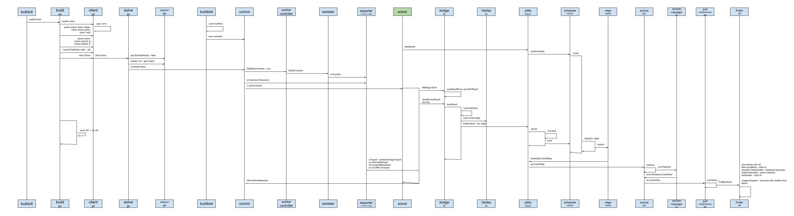
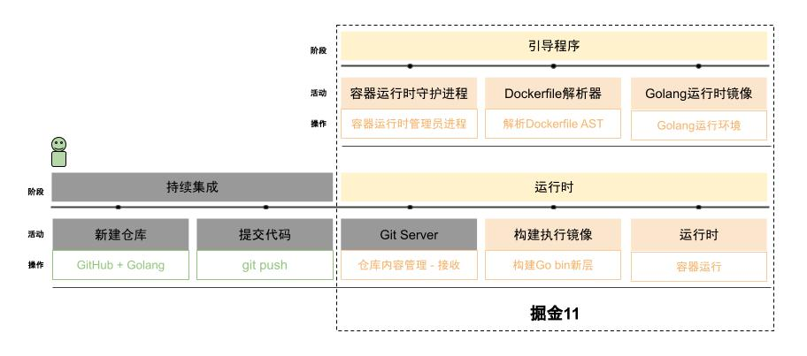
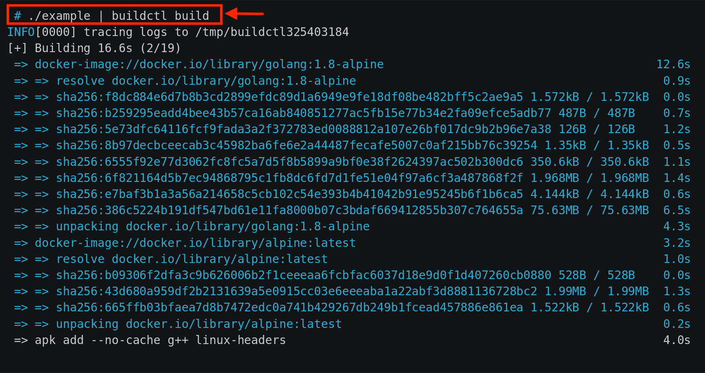
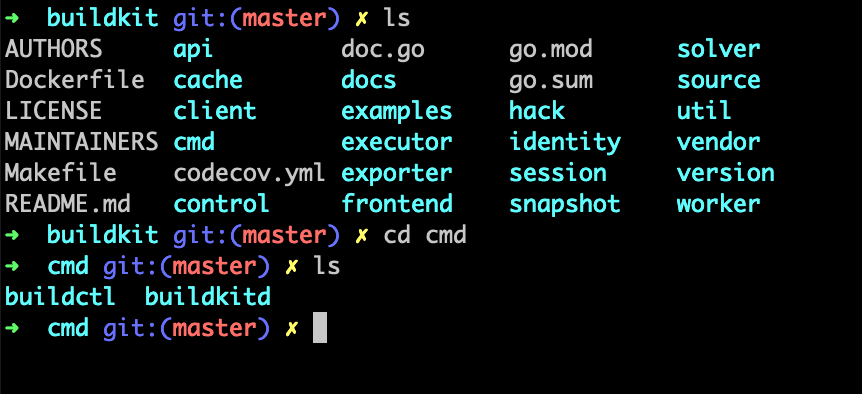
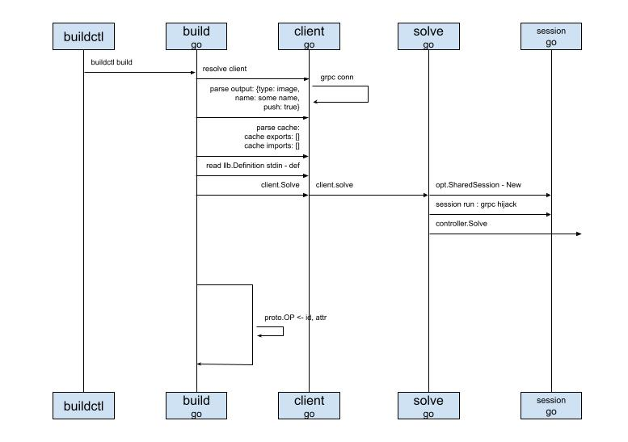

# 主线阅读

龙飞将主流程，时序图分享在电视上后，就迫不及待的讲了起来。

根据我们的Happy Path(是理想的工作流)，我们需要先关注镜像构建流程，也就是灰色的模块我们可以先不考虑。

这就是我重点在过去一周里学习的主线。
我直接找到GitHub上的p[源码](https://github.com/moby/buildkit)，就一头扎了进去。
哎，还别说，README第一张图，就是我需要去关注的主线：

通过第一行可以看出，用法很简单，将./example生成的内容，通过管道传给 `buildctl build`命令，就可以从远端获取镜像，并开始构建镜像了。

顺着这个思路，我就先找到了`buildctl`命令行。
说着就打开了命令行终端，向我们展示了代码的位置：

然后我就顺藤摸瓜，一步步的画起了时序图，当然还是先从命令行开始：

## buildctl
自然就是命令行本尊了，用的是一个第三方库，我还没来得急查看细节，不过看着用起来挺方便的

## build
就是我们的构建命令行了，也就是上面所指的`buildkit build`，将入口函数注册到了命令行框架里，触发命令的时候就会被调用，这里主要做了几件事情：

* 获取客户端实例 - client，我没记错的话，就是一个grpc client 
* 解析配置参数，从代码来看，可以指定output的形式，如tar包；还可以指定是否push构建好的镜像到远端registry
* 获取缓存配置参数，这里的缓存我还没弄清楚到底是干什么用的，先略过
* 从标准输入stdin读取llb.Definition，这个llb也不知道是什么缩写，但我猜类似于将Dockerfile解析好后的内部数据结构，在上面的例子中就是由`./example`shell脚本输出的内容
* 最后用创建好的client，调用client.Solve方法来发起连接

## client
提供多种client，如HTTP、GRPC，我们这里用的是GRPC。
然后由client发起连接请求。

## solve
这个文件主要做的事情就是发起真正的连接。
先初始化共享会话，在会话运行过程中，还进行了grpc hijack劫持，可能是要将无状态连接变成长连接，可能是出于交互的考虑吧，比如在容器运行的过程中产生的标准输出，需要回传给client，以供展示，这只是我的猜测，还没有验证。
最后调用`buildkitd`首护进程提供的控制器进行解析 - controller.Solve

一口气说完后，停顿了会，看了看袁小白和贾大智，问道：目前为止，有什么问题吗？
看着两人好像没什么反应。
就接着说道，那我准备讲下一部分 - `buildkitd`守护进程了。

### 知识点
用来记录一些出现的知识点，以后会把这些知识点展开来介绍。

* grpc
* hijack

