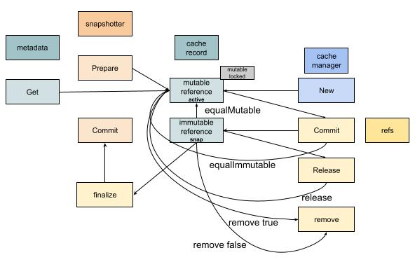

# SourceOp Exec

带着镜像基础信息准备好后，又将要用来做什么的问题。
袁小白重新回到edge.go的unpark函数里，看到了接下来的动作：
```golang
// execute op
if e.execReq == nil && desiredState == edgeStatusComplete {
   if ok := e.execIfPossible(f); ok {
      return
   }
}
```
顺着代码就找到了接下来需要发生的操作：`e.execReq = f.NewFuncRequest(e.execOp)`，原来又创建了一个请求，而这个请求依赖于上一个CacheMap操作的结束，和上一个操作类似，这里实际调用的是`e.op.Exec(ctx, toResultSlice(inputs))`，也就是Op的另一个操作 - *Exec*
```golang
func (s *sourceOp) Exec(ctx context.Context, g session.Group, _ []solver.Result) (outputs []solver.Result, err error) {
   src, err := s.instance(ctx)
   ...
   ref, err := src.Snapshot(ctx, g)
   ...
   return []solver.Result{worker.NewWorkerRefResult(ref, s.w)}, nil
}
```
instance和CacheMap一样，也就是说我们接下来要看，准备好image基本信息后，puller将会用这些信息来做什么？
```golang
func (p *puller) Snapshot(ctx context.Context, g session.Group) (ir cache.ImmutableRef, err error) {
   ...
   var current cache.ImmutableRef
   ...
   var parent cache.ImmutableRef
   for _, layerDesc := range p.manifest.Descriptors {
      parent = current
      current, err = p.CacheAccessor.GetByBlob(ctx, layerDesc, parent,
         p.descHandlers, cache.WithImageRef(p.manifest.Ref))
      if parent != nil {
         parent.Release(context.TODO())
      }
      if err != nil {
         return nil, err
      }
   }
   ...
   return current, nil
}
```
从返回参数cache.ImmutableRef可以看出，SourceOp执行后的结果就是用来准备这个immutableRef的。
我们准备SourceOp是为了ExecOp做准备，也就是说这个Snapshot方法是为了准备好容器运行时的基础镜像做准备的，很可能和rootfs相关。

从上面的代码来看，主要完成这个操作的是`p.CacheAccessor.GetByBlob`，这里的CacheAccessor又是什么呢？
还是运用以前的方法 - 去到worker被创建的地方：
```golang
cm, err := cache.NewManager(cache.ManagerOpt{
   Snapshotter:     opt.Snapshotter,
   PruneRefChecker: imageRefChecker,
   Applier:         opt.Applier,
   GarbageCollect:  opt.GarbageCollect,
   LeaseManager:    opt.LeaseManager,
   ContentStore:    opt.ContentStore,
   Differ:          opt.Differ,
   MetadataStore:   opt.MetadataStore,
})
...
sm, err := source.NewManager()
...
is, err := containerimage.NewSource(containerimage.SourceOpt{
   ...
   CacheAccessor: cm,
   ...
})
```
原来CacheAccessor就是cache.Manager，那自然这个GetByBlob就是由她提供的服务：
```golang
func (cm *cacheManager) GetByBlob(ctx context.Context, desc ocispecs.Descriptor, parent ImmutableRef, opts ...RefOption) (ir ImmutableRef, rerr error) {
   diffID, err := diffIDFromDescriptor(desc)
   ...
   chainID := diffID
   blobChainID := imagespecidentity.ChainID([]digest.Digest{desc.Digest, diffID})
   ...
   var p *immutableRef
   var parentID string
   ...
   sis, err := cm.searchBlobchain(ctx, blobChainID)
   ...

   for _, si := range sis {
      ref, err := cm.get(ctx, si.ID(), opts...)
      if err != nil && !IsNotFound(err) {
         return nil, errors.Wrapf(err, "failed to get record %s by blobchainid", sis[0].ID())
      }
      if ref == nil {
         continue
      }
      if p != nil {
         releaseParent = true
      }
      if err := setImageRefMetadata(ref.cacheMetadata, opts...); err != nil {
         return nil, errors.Wrapf(err, "failed to append image ref metadata to ref %s", ref.ID())
      }
      return ref, nil
   }

   sis, err = cm.searchChain(ctx, chainID)
   ...

   var link *immutableRef
   for _, si := range sis {
      ref, err := cm.get(ctx, si.ID(), opts...)
      // if the error was NotFound or NeedsRemoteProvider, we can't re-use the snapshot from the blob so just skip it
      if err != nil && !IsNotFound(err) && !errors.As(err, &NeedsRemoteProvidersError{}) {
         return nil, errors.Wrapf(err, "failed to get record %s by chainid", si.ID())
      }
      if ref != nil {
         link = ref
         break
      }
   }

   id := identity.NewID()
   snapshotID := chainID.String()
   blobOnly := true
   if link != nil {
      snapshotID = link.getSnapshotID()
      blobOnly = link.getBlobOnly()
      go link.Release(context.TODO())
   }
   ...
   md, _ := cm.getMetadata(id)
   rec := &cacheRecord{
      mu:            &sync.Mutex{},
      cm:            cm,
      refs:          make(map[ref]struct{}),
      parent:        p,
      cacheMetadata: md,
   }
   ...
   cm.records[id] = rec

   return rec.ref(true, descHandlers), nil
}
```
总体实现思路是：

* 根据desc计算diffID
* 准备chainID, blobChainID
* 用cache manager来搜索blobChain - `cm.searchBlobchain(ctx, blobChainID)`，如果找到了，就返回对应的ref
* 如果上面找不着，就从chain里找，`cm.searchChain(ctx, chainID)`
* 如果都没找着，就新建一个cacheRecord，并设置好对应的参数，并持久化 - `rec.commitMetada`

为了顺利走完buildkit的全流程，我们先专注在cache manager的cacheRecord，来看看它又是怎么设计的。

cache manager中存储了cache record的数组，从调用情况来看，是用来缓存现有的record的，用id进行存储。
那这样也好理解，如果id是唯一的，那么就方便下一次再有用到这个id的时候，就可以直接从缓存中命中。

进一步看cacheRecord定义的地方，发现复杂的是cacheRecord和immutableRef及mutable Ref之间的关系：
```golang
type immutableRef struct {
   *cacheRecord
   triggerLastUsed bool
   descHandlers    DescHandlers
}

type mutableRef struct {
   *cacheRecord
   triggerLastUsed bool
   descHandlers    DescHandlers
}
```
这两个Ref都是cacheRecord的拓展。
为了进一步了解她们的工作原理，袁小白打开了`manager_test.go`，仔细研读了起来。

经过一番摸索，袁小白终于弄清楚了她们之间的逻辑：



原来cacheRecord只是用来存储基础数据的，里面有metadata来做持久化操作，这个metadata也挺有趣，值得研究一下。
而重点是mutableRef和immutableRef，这两个状态可以互相转换。
而谁需要这两个状态呢，答案是snapshotter，当snapshotter.Prepare的时候会产生mutableRef，也就是这个时候是可以修改的；mutableRef通过Commit可以转换成immutableRef的状态；最后immutableRef可以通过finalize，并commit到snapshotter。
（这又是一个containerd项目里的包，我们先不在这里展开，记录在下面的知识点里，以避免走进了免子洞，一个接一个，没完没了。）

为什么要这样设计了，可以设想一下。
如果我要提高构建dockerfile的效率，像From这样的操作可能同时会进行好几个，很有可能他们都有一个能用的基础镜像，这在实际使用中，是很容易出现的。
如果每一个都独立构建，那肯定没有必要，浪费时间。
如果想要共用一个，就得进行缓存，这时需要有唯一标识，也就是我们前面看到的ID。
对于dockerfile里的下一个操作，前面的都可以认为是一个独立的基础镜像，在docker里，会把一个镜像的索引叫Ref，也就是索引。
与此同时，有时候需要提交准备好文件系统diff的信息，并挂载成一个文件系统，其中有docker推荐的overlay2文件系统，那我们就需要可以修改的ref，也就是mutableRef。
一旦有操作基于文件系统进行执行，那这时就需要变成不可修改状态, immutableRef。
必竞她们的数据信息是一致的，也就需要像cacheRecord这样的数据结构来承载相关信息，并支持缓存。

哦，原来SourceOp执行的结果就是准备好snapshotter，也就是快照，这个快照可以为接下来的ExecOp提供rootfs相关的服务支持。

那ExecOp的CacheMap和Exec又是干什么的呢？
有点小期待呢！

### 新的知识点
在CacheMap中，当我们拉取manifests的时候，我们用的是containerd提供的库。
在上面我们又涉及到OCI中image相关的一些概念，像diffid, chainid, desc等等。
我们都简化的理解为image的领域语言，也就是出现在image上下文里的实体或值对象。
后续会帮大家把containerd, oci相关的源码解读安排上。
下面做一个记录。

* Containerd
  * snapshotter
* OCI
