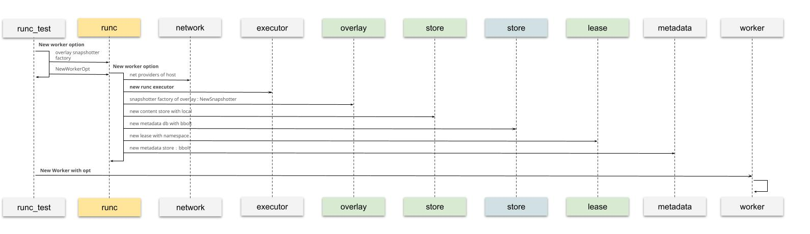
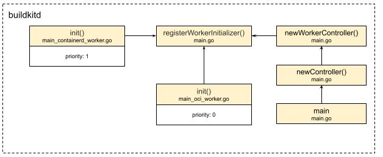
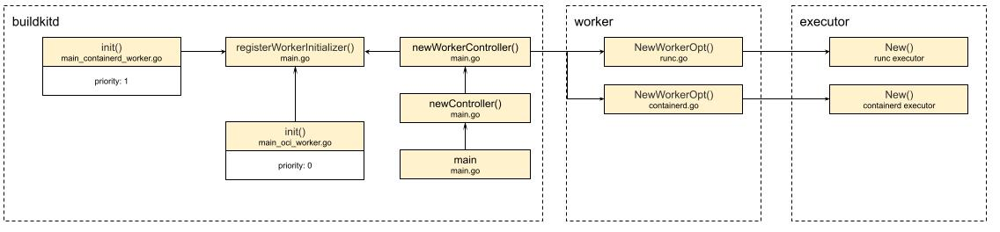

# ExecOp的运行时

通过传入的inputs，execOp可以准备好镜像索引refs，并准备好挂载点，并得到挂载好的`PreparedMounts`。
准备好后，我们就可以开始运行这个操作了：
```golang
func (e *execOp) Exec(ctx context.Context, g session.Group, inputs []solver.Result) (results []solver.Result, err error) {
   ...
   p, err := gateway.PrepareMounts(ctx, e.mm, e.cm, g, e.op.Meta.Cwd, e.op.Mounts, refs, func(m *pb.Mount, ref cache.ImmutableRef) (cache.MutableRef, error) {
      desc := fmt.Sprintf("mount %s from exec %s", m.Dest, strings.Join(e.op.Meta.Args, " "))
      return e.cm.New(ctx, ref, g, cache.WithDescription(desc))
   })
   ...
   meta := executor.Meta{
      Args:           e.op.Meta.Args,
      Env:            e.op.Meta.Env,
      Cwd:            e.op.Meta.Cwd,
      User:           e.op.Meta.User,
      Hostname:       e.op.Meta.Hostname,
      ReadonlyRootFS: p.ReadonlyRootFS,
      ExtraHosts:     extraHosts,
      Ulimit:         e.op.Meta.Ulimit,
      CgroupParent:   e.op.Meta.CgroupParent,
      NetMode:        e.op.Network,
      SecurityMode:   e.op.Security,
   }
   ...
   stdout, stderr := logs.NewLogStreams(ctx, os.Getenv("BUILDKIT_DEBUG_EXEC_OUTPUT") == "1")
   defer stdout.Close()
   defer stderr.Close()

   execErr := e.exec.Run(ctx, "", p.Root, p.Mounts, executor.ProcessInfo{
      Meta:   meta,
      Stdin:  nil,
      Stdout: stdout,
      Stderr: stderr,
   }, nil)
   ...
   return results, errors.Wrapf(execErr, "process %q did not complete successfully", strings.Join(e.op.Meta.Args, " "))
}
```
剩下的执行逻辑就不复杂了，先是为运行做好充分准备，聊了`p.ReadonlyRootFS`，其它的基本上都是用户传入和默认配置的数据，比如我要在在容器里执行`echo hello world`，那这个命令就会被打散，并放入`e.op.Meta`中。
准备好meta后，就要开始执行了，`e.exec.Run`就是真正的运行语句。
可以看见用到了`p.Root`和`p.Mounts`，提供了文件系统所有的信息，进一步佐证了我们之前的判断。
另外还传入了stdout和stderr，这个也好理解。
如果我们想将容器运行时的日志保存下来，那就可以传入这两个句柄，用来接收信息。

流程是梳理完了，那exec是什么，又是怎么样实际运行的呢？
带着这个问题，袁小白又开始了探索与发现。
最先想到的，当然还是execOp被创建的地方：
```golang
ops.NewExecOp(v, op, baseOp.Platform, w.CacheMgr, w.ParallelismSem, sm, w.WorkerOpt.Executor, w)
```
发现倒数第二个参数，就是Executor - `w.WorkerOpt.Execcutor`，这里的w，自然就是worker了。
看来先要弄清楚worker的来历了：



经过查找，发现在runc_test.go文件中有相关的测试用例。
其中包含了如何创建worker:
* 首先要准备好WorkerOpts，在这里面包含了很多其它的实例，像snapshotter factory用来创建快照；content store用来在本地存放镜像；还有metadata db用来存放cacheRecord的相关基础数据；而最吸个我们关注的就是runc executor，从命名来看，应该还有其它的executor
* 接着拿着创建好的WorkerOpts，相当于worker的配置项，进行真正的实例化操作New Worker with opt

创建是梳理清楚了，那对于我们的这个用例，这个executor又是从哪儿来，怎么配置的呢？

## Worker注册


原来，在buildkitd启动的时候，main函数在创建controller - newController的时候，初始化了worker controller - newWorkerController，而worker controller通过执行遍历已注册的worker初始化函数，来真正的创建worker。
从图中可以看到，在真正运行main函数前，通过golang的init函数特性，我们提前将containerd workder和oci worker已经注册进去，并标明不同的优先级priority，在这里默认的worker是priority配置为0的oci。

## Worker实例化
```golang
func newWorkerController(c *cli.Context, wiOpt workerInitializerOpt) (*worker.Controller, error) {
   wc := &worker.Controller{}
   nWorkers := 0
   for _, wi := range workerInitializers {
      ws, err := wi.fn(c, wiOpt)
      ...
   }
   if nWorkers == 0 {
      return nil, errors.New("no worker found, rebuild the buildkit daemon?")
   }
   defaultWorker, err := wc.GetDefault()
   ...
   return wc, nil
}
```
原来，在遍历已注册的worker初始化函数后，在newWorkerController中的遍历`range workerInitializers`中，真正的初始化了这些worker。



从上图可以看到，实际通过调用各worker的NewWorkOpt方法后，分别创建了runc ececutor，和containerd executor，根据配置，默认的是runc executor。

那么我们可以回答最开始的那个问题了，`e.exec.Run`执行的到底是哪个运行时 - runc。

进到executor包，我们果然找到了`executor/oci/runcexecutor/executor.go`，打开文件，大大的Run函数映入眼帘:
```golang
func (w *runcExecutor) Run(ctx context.Context, id string, root executor.Mount, mounts []executor.Mount, process executor.ProcessInfo, started chan<- struct{}) (err error) {
   ...
   err = w.run(runCtx, id, bundle, process)
   ...
}

func (w *runcExecutor) run(ctx context.Context, id, bundle string, process executor.ProcessInfo) error {
   if process.Meta.Tty {
      return unsupportedConsoleError
   }
   _, err := w.runc.Run(ctx, id, bundle, &runc.CreateOpts{
      IO:      &forwardIO{stdin: process.Stdin, stdout: process.Stdout, stderr: process.Stderr},
      NoPivot: w.noPivot,
   })
   return err
}
```
可以看到Run里面进行了一系列的配置，在上面代码中省略掉的有rootFSPath, uid, gid, sgids等等。
最后调用的run才是真正执行的地方，而这里面用到了`w.runc.Run`，发现原来是`runc "github.com/containerd/go-runc"`(实际上这个库是fork https://github.com/opencontainers/runc)。
这里我们就不再展开。
（但保证后续把这个坑给填上，就在2022，还包括之前提到的containerd）

到这里，execOp的执行周期也就弄明白了。
