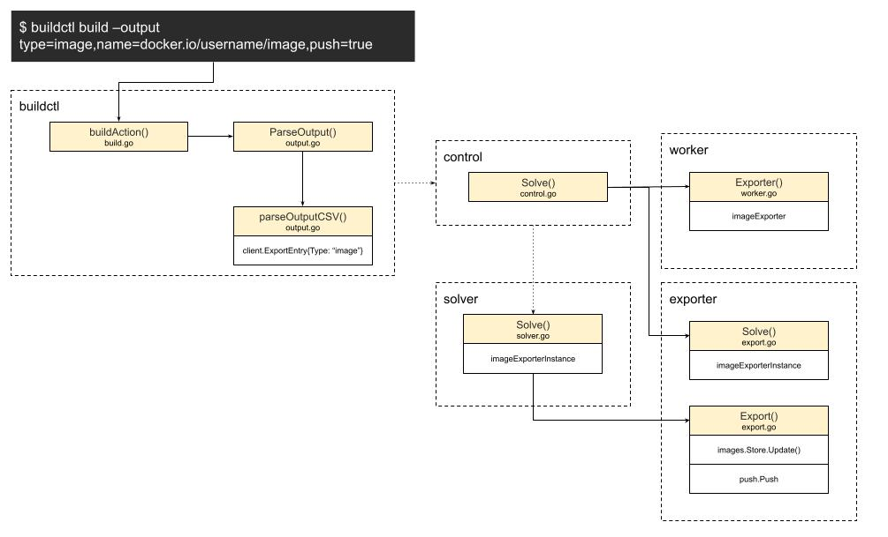

# 完美收关Exporter

SourceOp构建完后，就轮到了ExecOp。
现在所有的Op都执行完了，也就是我们的Edge都得到了遍历。

还记得我们从哪儿来的吗？
让我们一起来回顾一下。
没错，jobs收到构建请求后，由scheduler将edge进行了dispatch，这时候edge会进行unpark操作。

这里的关键是jobs, scheduler和unpark的配合：
- jobs存储了所有的inbounds和outgoing请求，管理整个构建事件的上下文。
- scheduler就像是一个事件总线，负责分发收到的dispatch事件。
- unpark则像是具体的事件处理中心，根据事件的状态和信息，对新的状态进行下一步的处理。

那构建完成后，谁会收到并处理返回的结果呢？

## Exporter
```shell
$ buildctl build ... --output type=image,name=docker.io/username/image,push=true
```
让我们回到用户命令的地方，没错，想要了解全貌，就得从头开始。
可以看到我们对输出output的要求是，以image类型进行输出，并以名字name为docker.io/username/image 的镜像进行推送到远端registry。

解铃还须系铃人。
让我们回到`solver.Solve`:
```golang
func (s *Solver) Solve(ctx context.Context, id string, sessionID string, req frontend.SolveRequest, exp ExporterRequest, ent []entitlements.Entitlement) (*client.SolveResponse, error) {
   j, err := s.solver.NewJob(id)
   if err != nil {
      return nil, err
   }

   defer j.Discard()

   set, err := entitlements.WhiteList(ent, supportedEntitlements(s.entitlements))
   if err != nil {
      return nil, err
   }
   j.SetValue(keyEntitlements, set)

   j.SessionID = sessionID

   var res *frontend.Result
   if s.gatewayForwarder != nil && req.Definition == nil && req.Frontend == "" {
      ...
   } else {
      res, err = s.Bridge(j).Solve(ctx, req, sessionID)
      ...
   }
   ...
   eg, ctx2 := errgroup.WithContext(ctx)
   res.EachRef(func(ref solver.ResultProxy) error {
      eg.Go(func() error {
         _, err := ref.Result(ctx2)
         return err
      })
      return nil
   })
   ...
   var exporterResponse map[string]string
   if e := exp.Exporter; e != nil {
      ...
      if err := inBuilderContext(ctx, j, e.Name(), "", func(ctx context.Context, _ session.Group) error {
         exporterResponse, err = e.Export(ctx, inp, j.SessionID)
         return err
      }); err != nil {
         return nil, err
      }
   }
   ...
   return &client.SolveResponse{
      ExporterResponse: exporterResponse,
   }, nil
}
```
通过`s.Bridge(j).Solve`解析，获取所有的ref解析结果`res.EachRef - ref.Result`，最后导出返回值`exporterResponse, err = e.Export(...)`

那这里的Export指的又是什么呢？让我们将这些点都连接起来，来讲讲Export的故事：


* 当用户的构建指令传递给命令行buildctl时，buildAction首先接收到信息，通过ParseOutput入口，将字符串信息解析成对应的数据结构，最终得到Type为image的ExportEntry并返回，这样命令行的解析工作就完成了。
* 当前端client将解析命令传递给后端也就是`buildkitd`时，最先接收到相关信息的是control，并通过Solve方法，将信息传递给workerController
* 如上一篇所述，workerController提前注册好可用worker的初始化函数，并初始化了worker实例，不过worker对应的主要有executor，并没有exporter，这是因为exporter更普遍，被安置在了base worker里，所以在Solve export的时候，实际提供服务的是：
```golang
func (w *Worker) Exporter(name string, sm *session.Manager) (exporter.Exporter, error) {
   switch name {
   case client.ExporterImage:
      return imageexporter.New(imageexporter.Opt{
         Images:         w.ImageStore,
         SessionManager: sm,
         ImageWriter:    w.imageWriter,
         RegistryHosts:  w.RegistryHosts,
         LeaseManager:   w.LeaseManager,
      })
   ...
}
```
* 在这里，我们得到了exporter的实例，也就是imageExporterInstance。
* 最后，solver在调用exporter的Export方法时，实际提供服务的是imageExporterInstance实例
```golang
func (e *imageExporterInstance) Export(ctx context.Context, src exporter.Source, sessionID string) (map[string]string, error) {
   ...
   if e.targetName != "" {
      targetNames := strings.Split(e.targetName, ",")
      for _, targetName := range targetNames {
         if e.opt.Images != nil {
            ...
            for _, sfx := range sfx {
               img.Name = targetName + sfx
               if _, err := e.opt.Images.Update(ctx, img); err != nil {
                  ...
               }
            }
            tagDone(nil)
            ...
}
         if e.push {
            ...
            if err := push.Push(ctx, e.opt.SessionManager, sessionID, mprovider, e.opt.ImageWriter.ContentStore(), desc.Digest, targetName, e.insecure, e.opt.RegistryHosts, e.pushByDigest, annotations); err != nil {
               return nil, err
            }
         }
      }
      resp["image.name"] = e.targetName
   }
   ...
   return resp, nil
}
```
根据用例传入的参数，targetName不为空，则需要存储和更新image，e.push状态也为真，会调用util里的push包来上传推送镜像。

系列完
----

### 续
不知不觉已经看完了`buildctl build`的全构建流程。
要想完全理解，还需要更多的例子，以及一些对一些细节的补充说明，如metadata store, cache manager，等等。
其中关键的部分有SourceOp的snapshotter，ExecOp的runc容器运行时。
不过GitAction在这里挖好了坑，也一定会把这些坑填起来。
秉着`Talk is cheap, show me the code!`原则，手动撸一个容器全生命周期工具，也不是完全没有可能。

一起期待吧！
