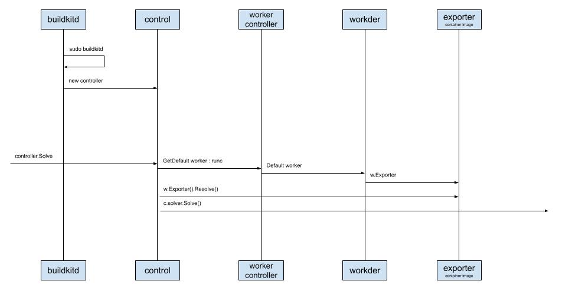

# Buildkitd守护进程

书接前文。
说龙飞一口气介绍完了`Buildctl build`命令行的前半部分 - client的工作流程，看了眼没有反应的袁小白和贾大智。已经近不急待的准备讲解下一部分了 - Buildkitd。

袁小白可能真的没有什么想说的，毕竟听起来好像没什么特殊的，就是一些新鲜词不停的蹦了出来，不过早就习惯了。
贾大智到是一副若有所思的样子，但看样子，好像也示意着继续往下讲。

龙飞滚动了时序图，到了中间的部分。
停顿了一下，说道：这里可是花了我一点时间，因为在`buildkitd`启动后，初始化了好些大家伙。
这一下确实引起了另两个人的注意。

看到袁小白若有所思，龙飞问道：小白是有什么问题吗？

到不是什么大问题，就想问下为什么后面加个字母`d`，有什么含义吗？

哦，这个啊，`d`是Daemon的首字母，在计算机领域中，翻译过来是守护进程的意思，指的是在后台进行的进程，用来接收请求用的。
像Linux的`initd`，还有CNCF（Cloud Native Computing Foundation）的`containerd`，都是按这个风格来命名的。龙飞笑着回答道。

那好我们来看Buildkitd启动后，接收请求的部分先：

## buildkitd
就是刚说的守护进程，会在后台以进程的形式运行，接收发过来的请求。
启动的时候用的是`sudo`，也就是这个进程需要管理员权限。
创建了一个`control`实例，后面可以看到，接收和处理请求基本上都是这个控制器。
而且这里用的也是MVC模式。

## control
为什么说控制器做了主要的工作呢。
因为守护进程启动后，正式解析一个请求时，控制器会做以下几项工作：
* 获取`worker`，并且默认的是`runc`(容器运行时命令行工具)，并且会帮助指定`Exporter`
* 调用`Exporter`进行解析，并进行配置
* 初始化`solver`，而这个求解器应该是我们重点需要关注的了

看起来很简单，对不对，但当我继续往后梳理的时候，我不得不一次次的又重新回到这里。
因为golang里定义了接口后，会有很多不同的实现者，而我们的编缉器只能帮助我们索引到接口级别，并不能智能索引到实现者，这时我就需要在初始化的源头，特别关注一下这些默认的设置，费了我不少时间。
如果你们发现有什么好的编缉器插件，记得分享给我一下。

这种情况到是不奇怪，面向接口编程时，编缉器是有些用不上力。
贾大智顺嘴说到。

### 下一篇：深入理解Moby Buildkit系列 #5 - Buildkitd守护进程的引擎

### 知识点
用来记录一些出现的知识点，以后会把这些知识点展开来介绍。

* MVC
* runc

