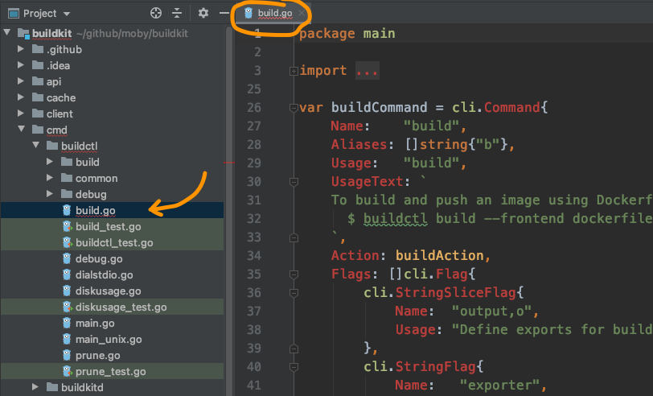
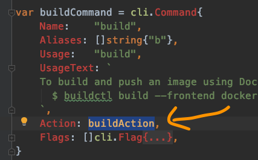
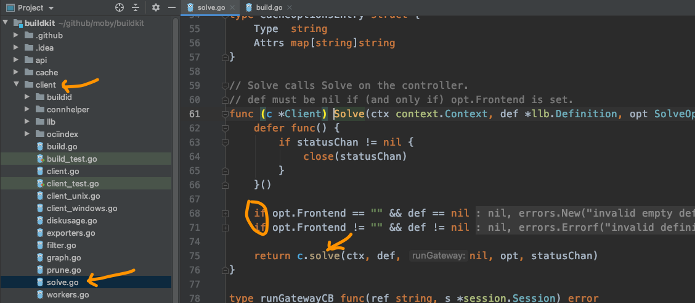
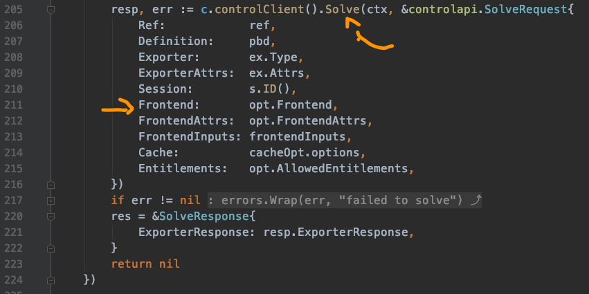
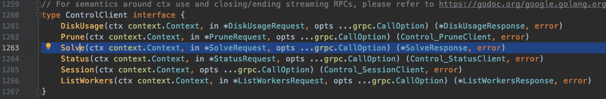
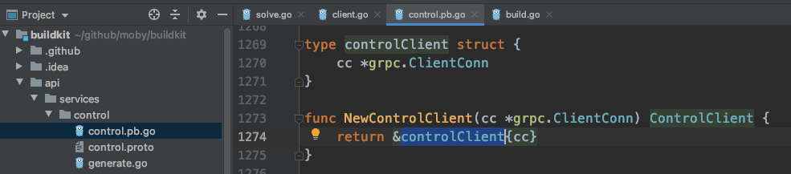
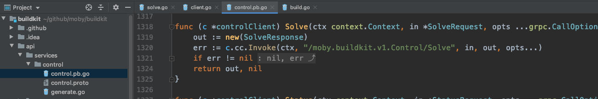

# 失踪的frontends

袁小白感觉自己状态不错，准备一鼓作气，走通frontends流程。
还没等编缉器自动装好依赖，就迫不及待的出发了。



直接定位到`build`子命令，就发现这个子命令的入口函数就是`buildAction`:




```golang
func buildAction(clicontext *cli.Context) error {
   c, err := bccommon.ResolveClient(clicontext)
   if err != nil {
      return err
   }

   ...

   eg, ctx := errgroup.WithContext(bccommon.CommandContext(clicontext))

   solveOpt := client.SolveOpt{
      Exports: exports,
      // LocalDirs is set later
      Frontend: clicontext.String("frontend"),
      // FrontendAttrs is set later
      CacheExports:        cacheExports,
      CacheImports:        cacheImports,
      Session:             attachable,
      AllowedEntitlements: allowed,
   }

   ...

   var def *llb.Definition
   if clicontext.String("frontend") == "" {
      if fi, _ := os.Stdin.Stat(); (fi.Mode() & os.ModeCharDevice) != 0 {
         return errors.Errorf("please specify --frontend or pipe LLB definition to stdin")
      }
      def, err = read(os.Stdin, clicontext)
      if err != nil {
         return err
      }
      if len(def.Def) == 0 {
         return errors.Errorf("empty definition sent to build. Specify --frontend instead?")
      }
   } else {
      if clicontext.Bool("no-cache") {
         solveOpt.FrontendAttrs["no-cache"] = ""
      }
   }
   ...
   eg.Go(func() error {
      ...
      resp, err := c.Solve(ctx, def, solveOpt, progresswriter.ResetTime(mw.WithPrefix("", false)).Status())
      ...
      return nil
   })

   ...
   return eg.Wait()
}
```
这里的主要流程是：
* 获取客户端client - `bccommon.ResolveClient(clicontext)`
* 准备好solveOpt，其中包含了Frontend
* 判断命令行里是否有传入"frontend"，如果没有设置，就像龙飞举的例子`./example | buildctl build`，这时就从os.Stdin标准输入中读取数据，这里对应的是`def, err = read(os.Stdin, clicontext)`。如果有设置，就像在命令行使用说明里的`$ buildctl build --frontend dockerfile.v0 --opt target=foo --opt build-arg:foo=bar --local context=. --local dockerfile=. --output type=image,name=docker.io/username/image,push=true`，则看看是否有缓存相关的配置
* 最后交由`c.Solve`统一处理

嗯，目前为止还算清晰。


开始进入到了client package下的solve.go。
可以看出第一个出现的`solve`，主要是判断，在参数中关于Frontend的配置情况，如果没有设计，那def就不能为空，也就是要从os.Stdin中读取；如果Frontend不为，像`dockerfile.v0`，那def就得为空，因为这时候不接受标准输入了，会从`--local dockerfile=.`中读取构建信息。

可以注意到，下一步就是进入到了小写的`solve`这个函数，在golang里，是区分大小写的，也就是说这是两个函数。
并且golang认为大写开头的就相当于public函数，而小写开头的就是private函数，适应后感觉也挺方便。

算上前面两个solve，这时第三个solve又出现了 - `c.controlClient().Solve(...)`。

当我们直接跳转到第三个Solve时，来到了接口定义处：

当全局搜索时，发现有很多solve，这可怎么办？
突然想起这是由`c.controlClient()`所返回对象的方法，那就先看看究竟返回了个啥：

原来到了这里，那就是说这个结构体实现了solve方法，果不其然：

再一次出现了solve，这一次还是个远程调用`c.cc.Invoke(ctx, "/moby.buildkit.v1.Control/Solve", ...)`

这下好了，上哪儿找c.cc去，frontend还不见了。
看着凉了的茶水，肚子也咕咕叫了几下。
那就明天去问问龙飞吧，看看有什么建议。
